# VibeCheck End-to-End (E2E) Feature Testing Guide

Comprehensive sequential test plan covering all features across the three core roles: **SuperAdmin**, **Organiser**, and **Attendee**.

---

## 🗺️ High-Level Test Flow

```mermaid
flowchart LR
    subgraph Phase1["1. Admin Setup"]
        A1[Configure Cities & Config]
    end
    subgraph Phase2["2. Organiser Onboarding"]
        O1[Apply as Organiser] --> A2[Admin Approves Application]
    end
    subgraph Phase3["3. Event Creation"]
        O2[Organiser Creates & Publishes Event] --> A3[Admin Moderates / Features Event]
    end
    subgraph Phase4["4. Attendee Flow"]
        U1[Discover Event & Set Preferences] --> U2[RSVP & Claim QR Pass]
    end
    subgraph Phase5["5. Live Event Day"]
        O3[Staff Uses Scanner at Venue] --> U3[Attendee Checks In via QR]
    end
    subgraph Phase6["6. Post-Event"]
        U4[Attendee Rates & Leaves Feedback] --> O4[Organiser Checks Analytics & CRM]
    end

    A1 --> O1
    A2 --> O2
    A3 --> U1
    U2 --> O3
    U3 --> U4
    U4 --> O4
```

---

## 📋 Phase 1: SuperAdmin — Master Setup & Platform Health

*Goal: Ensure system baselines, active cities, news/currents, and master configurations are in place.*

### Step 1: SuperAdmin Login & Dashboard Verification
- **Route:** `/admin`
- **Actions:**
  1. Navigate to `/admin`.
  2. Authenticate using SuperAdmin credentials.
- **Verification:**
  - [ ] Dashboard metrics load (Total Users, Active Events, Pending Applications, Active Broadcasts).
  - [ ] Admin navigation sidebar is fully accessible.

### Step 2: City Management
- **Route:** `/admin/cities`
- **Actions:**
  1. Open the City Management tab.
  2. Add a new test city (e.g., `Bangalore` or `Mumbai`).
  3. Toggle the city status to **Active**.
- **Verification:**
  - [ ] The city appears in the active cities table.
  - [ ] The city is selectable in the public city picker on `/`.

### Step 3: Publish Local Currents / News Feed
- **Route:** `/admin/news`
- **Actions:**
  1. Click **Create News Drop**.
  2. Fill in Title, Content, Tags (e.g., `Underground`, `Weekend Picks`), and upload a banner image.
  3. Publish the item.
- **Verification:**
  - [ ] News item is displayed immediately on `/local-currents`.

---

## 📋 Phase 2: Organiser — Application & Onboarding

*Goal: Test self-service application submission and profile creation.*

### Step 4: Submit Organiser Application
- **Route:** `/organizer/apply`
- **Actions:**
  1. Open an incognito window or log out of SuperAdmin.
  2. Fill out the application form:
     - Brand / Collective Name
     - Contact Email & Phone
     - Social media links (Instagram, Soundcloud, etc.)
     - Description & City
  3. Submit the application.
- **Verification:**
  - [ ] Success screen is displayed with status **Pending Verification**.
  - [ ] An application record is created in the database.

---

## 📋 Phase 3: SuperAdmin — Organiser Review & Approval

*Goal: Test admin verification, role promotion, and activation.*

### Step 5: Review & Approve Organiser
- **Route:** `/admin/organizers`
- **Actions:**
  1. Go to the pending organizer applications section.
  2. Inspect the application submitted in Step 4.
  3. Click **Approve**.
- **Verification:**
  - [ ] Organiser status changes to `Active`.
  - [ ] Organiser is granted access to the `/organizer` dashboard.

---

## 📋 Phase 4: Organiser — Event Creation, Ticketing & Publishing

*Goal: Set up an event, configure capacity, upload media, and manage passes.*

### Step 6: Organiser Login & Brand Profile Setup
- **Route:** `/organizer`
- **Actions:**
  1. Log in with the approved Organiser account.
  2. Configure Profile (Avatar, Cover Banner, Bio, Social Links).
- **Verification:**
  - [ ] Organizer dashboard loads with zero-state analytics and heat grid.

### Step 7: Create & Publish a New Event
- **Route:** `/organizer` (Create Event Modal)
- **Actions:**
  1. Click **Create Event**.
  2. Fill in:
     - **Title & Subtitle**
     - **Date & Time Range** (Set for today/upcoming)
     - **Venue / Location** (Address & City)
     - **Category & Vibe Tags** (e.g., `Techno`, `Underground`, `Live`)
     - **Banner Image** (Upload via Cloudinary picker)
     - **Capacity & Ticket Pricing** (Set pass limits and free/paid tier)
  3. Set status to **Published** and save.
- **Verification:**
  - [ ] Event appears in the organizer's active events list with a unique Event ID.
  - [ ] Event is discoverable on public listings.

---

## 📋 Phase 5: SuperAdmin — Event Moderation & Broadcast Campaigns

*Goal: Moderate events, grant featured badges, and test audience broadcasts.*

### Step 8: Event Moderation & Featuring
- **Route:** `/admin/events`
- **Actions:**
  1. Search for the newly created event.
  2. Toggle the **Featured** / **Verified** badge on.
- **Verification:**
  - [ ] Event displays the "Featured" badge on the public home feed (`/`).

### Step 9: Broadcast Campaign Trigger
- **Route:** `/admin/broadcasts`
- **Actions:**
  1. Compose a broadcast message targeted by city or category.
  2. Send a test broadcast to connected channels (WhatsApp / Telegram / Push).
- **Verification:**
  - [ ] Broadcast execution completes without errors in the logs.

---

## 📋 Phase 6: Attendee — Discovery, Personalization & Pass Issuance

*Goal: Test attendee search, filtering, preference storage, and RSVP flow.*

### Step 10: Event Discovery & Search
- **Route:** `/` and `/calendar`
- **Actions:**
  1. As an Attendee, filter events by the active city and vibe tags.
  2. Open the event page at `/event/[eventId]`.
- **Verification:**
  - [ ] Banner, venue details, lineup, description, and organizer card load correctly.

### Step 11: Attendee Authentication & Preferences
- **Route:** `/preferences` or `/dashboard`
- **Actions:**
  1. Sign in via Phone / Google / Email.
  2. Select music tastes, vibe interests, and notification preferences.
  3. Save preferences.
- **Verification:**
  - [ ] Preferences persist across page reloads.

### Step 12: Claim Pass / RSVP
- **Route:** `/event/[eventId]`
- **Actions:**
  1. Click **"RSVP / Get Pass"**.
  2. Fill in registration details and confirm booking.
- **Verification:**
  - [ ] Booking confirmation appears.
  - [ ] Dynamic QR Pass is generated and viewable on `/dashboard`.
  - [ ] Attendee appears in the event guest list.

---

## 📋 Phase 7: External Integrations (WhatsApp & Telegram Bots)

*Goal: Test conversational AI, search (RAG), and pass delivery.*

### Step 13: Bot Matchmaker & Pass Delivery
- **Actions:**
  1. Open the Telegram or WhatsApp bot and send `/start` or query: *"What events are happening tonight in Bangalore?"*.
- **Verification:**
  - [ ] Bot responds with the newly created event using RAG search.
  - [ ] Pass confirmation card / QR link is accessible via chat.

---

## 📋 Phase 8: Organiser & Door Staff — Gate Scanner & Live Check-in

*Goal: Test QR code validation, door entry, and duplicate entry prevention.*

### Step 14: Launch Event Scanner
- **Route:** `/scanner/[eventId]`
- **Actions:**
  1. Open the scanner on mobile or desktop browser.
  2. Enter scanner PIN or authenticate as the event organizer.
- **Verification:**
  - [ ] Camera viewfinder starts and manual input field is available.

### Step 15: Valid Pass Check-In
- **Actions:**
  1. Scan the Attendee's QR Pass generated in Step 12.
- **Verification:**
  - [ ] Green **"Access Granted / Valid Pass"** screen with Attendee Name.
  - [ ] Pass status updates to `CHECKED_IN` in the backend.

### Step 16: Duplicate Entry & Invalid Pass Prevention
- **Actions:**
  1. Scan the exact same QR pass a second time.
  2. Scan an invalid / random QR code.
- **Verification:**
  - [ ] Rescan triggers red **"Warning: Pass Already Used"** with previous check-in time.
  - [ ] Invalid QR triggers red **"Invalid Pass"** error.

---

## 📋 Phase 9: Post-Event Engagement, Ratings & Organizer CRM

*Goal: Test feedback loops, follower subscriptions, and analytics aggregation.*

### Step 17: Attendee Feedback & Follow
- **Route:** `/event/[eventId]` or `/dashboard`
- **Actions:**
  1. As the checked-in Attendee, submit a 1–5 star rating and review.
  2. Click **Follow** on the Organiser's profile.
- **Verification:**
  - [ ] Rating and review are saved.
  - [ ] Organiser's follower count increases by 1.

### Step 18: Organiser Analytics & CRM Inspection
- **Route:** `/organizer`
- **Actions:**
  1. Return to the Organiser dashboard.
  2. Inspect:
     - Real-time page views and RSVP numbers.
     - Check-in conversion percentage (e.g., 100% for checked-in test pass).
     - Guest list showing `CHECKED_IN` status.
     - Attendee reviews and ratings feed.
- **Verification:**
  - [ ] Metrics match the test session numbers accurately.

---

## 📋 Phase 10: SuperAdmin — Command & Control Audit

*Goal: Verify platform health, background jobs, and data consistency.*

### Step 19: Command & Control Audit
- **Route:** `/admin/command-control`
- **Actions:**
  1. Check background cron logs (Matchmaker execution, AI RAG indexing).
  2. Inspect system audit logs.
- **Verification:**
  - [ ] All event creation, approvals, broadcasts, and check-in events are logged.

### Step 20: Clean-up (Optional)
- **Actions:**
  1. Archive or cancel the test event from `/admin/events` or `/organizer`.
- **Verification:**
  - [ ] Event is removed from active public feeds.

---

## 📊 Quick Role & Execution Matrix

| # | Step Name | Role | Route | Expected Outcome |
|---|---|---|---|---|
| **1** | Platform & City Setup | **SuperAdmin** | `/admin`, `/admin/cities` | City created and activated |
| **2** | Currents Drop | **SuperAdmin** | `/admin/news` | Post visible on `/local-currents` |
| **3** | Organiser Application | **Organiser** | `/organizer/apply` | Application submitted as pending |
| **4** | Application Approval | **SuperAdmin** | `/admin/organizers` | Organiser account active |
| **5** | Profile & Event Setup | **Organiser** | `/organizer` | Event published with ticket tiers |
| **6** | Event Moderation | **SuperAdmin** | `/admin/events` | Event featured on `/` |
| **7** | Discovery & RSVP | **Attendee** | `/`, `/event/[id]` | Pass generated in `/dashboard` |
| **8** | Bot RAG & Messaging | **Attendee** | WhatsApp / Telegram | AI search finds event & pass |
| **9** | Gate Check-in Scan | **Organiser** | `/scanner/[eventId]` | Valid pass approved; dupes blocked |
| **10** | Rating & Follow | **Attendee** | `/event/[id]` | Review saved, follower added |
| **11** | Review CRM & Stats | **Organiser** | `/organizer` | Check-in stats & guest list updated |
| **12** | Command Audit | **SuperAdmin** | `/admin/command-control` | Logs & background crons healthy |
