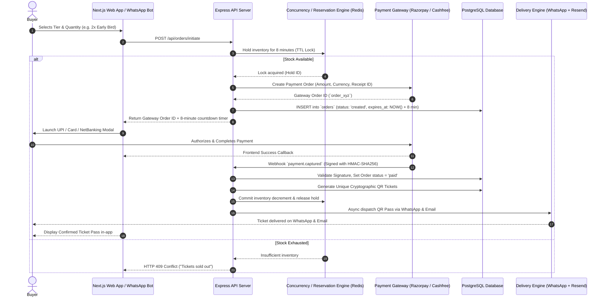

# VibeCheck Event Commerce & Ticketing Architecture Plan
**Document Version:** 1.0  
**Target Milestone:** Future Implementation / Production Roadmap  
**Scope:** End-to-End Ticketing, Payment Gateway, Escrow/Settlement, Concurrency Locking, and Community-First Differentiators

---

## 1. Executive Summary & Competitive Advantage

VibeCheck is building a modern, community-first event commerce engine designed to disrupt legacy ticketing platforms (BookMyShow, Paytm Insider, Eventbrite). 

### How VibeCheck Outperforms Legacy Platforms:
1. **Transparent, All-Inclusive Pricing:** Eliminates checkout fee shock with upfront flat/transparent fees instead of 15–20% hidden convenience fees.
2. **Native WhatsApp Concierge & Instant Delivery:** Frictionless ticket discovery, UPI payment, and QR ticket delivery directly inside WhatsApp via the Meta Cloud API.
3. **Organizer Audience Ownership (Creator CRM):** Unlike BookMyShow which hoards user data, VibeCheck provides organizers with real-time follower CRM, direct broadcast messaging, and customer analytics.
4. **Creator-Friendly Economics:** 3–5% platform fee (vs. BMS's 10–18%) with rapid **T+2 post-event automated settlements**.
5. **Social Ticketing Layer:** Native group UPI split-pay, secure 1-click ticket transfers/fan exchange, and opt-in "Vibe Match" social networking.

---

## 2. High-Level System Architecture



---

## 3. Database Schema (PostgreSQL DDL)

To support multi-tier ticket sales, financial ledgers, QR validation, and organizer payouts, the following tables must be added to `db/init.sql`.

```sql
-- 1. Ticket Tiers per Event
CREATE TABLE IF NOT EXISTS ticket_tiers (
    id UUID PRIMARY KEY DEFAULT gen_random_uuid(),
    event_id UUID NOT NULL REFERENCES events(id) ON DELETE CASCADE,
    name VARCHAR(100) NOT NULL,                -- e.g. "Early Bird", "Phase 1", "VIP Pass"
    description TEXT,
    price NUMERIC(10, 2) NOT NULL DEFAULT 0.00, -- 0.00 for free RSVP
    total_quantity INTEGER NOT NULL,            -- Total capacity allocated
    available_quantity INTEGER NOT NULL,        -- Decremented on confirmed purchase
    max_per_user INTEGER DEFAULT 10,            -- Max tickets per purchase
    sales_start_time TIMESTAMP WITH TIME ZONE DEFAULT CURRENT_TIMESTAMP,
    sales_end_time TIMESTAMP WITH TIME ZONE,
    is_active BOOLEAN DEFAULT true,
    created_at TIMESTAMP WITH TIME ZONE DEFAULT CURRENT_TIMESTAMP,
    updated_at TIMESTAMP WITH TIME ZONE DEFAULT CURRENT_TIMESTAMP
);

CREATE INDEX idx_ticket_tiers_event ON ticket_tiers(event_id);

-- 2. Customer Orders
CREATE TYPE order_status AS ENUM (
    'created',      -- Initiated, inventory locked (awaiting payment)
    'processing',   -- Gateway processing
    'paid',         -- Payment captured, tickets issued
    'failed',       -- Payment declined
    'expired',      -- 8-minute lock expired without payment
    'refunded',     -- Fully refunded
    'partially_refunded'
);

CREATE TABLE IF NOT EXISTS orders (
    id UUID PRIMARY KEY DEFAULT gen_random_uuid(),
    user_email VARCHAR(255) NOT NULL,
    user_phone VARCHAR(50),
    event_id UUID NOT NULL REFERENCES events(id) ON DELETE RESTRICT,
    subtotal NUMERIC(10, 2) NOT NULL,          -- Base ticket price sum
    convenience_fee NUMERIC(10, 2) DEFAULT 0.00,-- Platform fee
    tax_amount NUMERIC(10, 2) DEFAULT 0.00,    -- 18% GST on convenience fee
    total_amount NUMERIC(10, 2) NOT NULL,      -- Final charged amount
    currency VARCHAR(10) DEFAULT 'INR',
    status order_status DEFAULT 'created',
    gateway_provider VARCHAR(50) DEFAULT 'razorpay', -- 'razorpay' | 'cashfree' | 'stripe'
    gateway_order_id VARCHAR(255) UNIQUE,
    gateway_payment_id VARCHAR(255),
    gateway_signature VARCHAR(255),
    expires_at TIMESTAMP WITH TIME ZONE NOT NULL, -- 8 minutes from creation
    metadata JSONB DEFAULT '{}'::jsonb,
    created_at TIMESTAMP WITH TIME ZONE DEFAULT CURRENT_TIMESTAMP,
    updated_at TIMESTAMP WITH TIME ZONE DEFAULT CURRENT_TIMESTAMP
);

CREATE INDEX idx_orders_user ON orders(user_email);
CREATE INDEX idx_orders_event ON orders(event_id);
CREATE INDEX idx_orders_status ON orders(status);
CREATE INDEX idx_orders_expiry ON orders(expires_at) WHERE status = 'created';

-- 3. Order Line Items
CREATE TABLE IF NOT EXISTS order_items (
    id UUID PRIMARY KEY DEFAULT gen_random_uuid(),
    order_id UUID NOT NULL REFERENCES orders(id) ON DELETE CASCADE,
    tier_id UUID NOT NULL REFERENCES ticket_tiers(id) ON DELETE RESTRICT,
    quantity INTEGER NOT NULL,
    unit_price NUMERIC(10, 2) NOT NULL,
    created_at TIMESTAMP WITH TIME ZONE DEFAULT CURRENT_TIMESTAMP
);

-- 4. Issued Tickets & Security Verification
CREATE TYPE ticket_status AS ENUM ('valid', 'checked_in', 'transferred', 'cancelled');

CREATE TABLE IF NOT EXISTS tickets (
    id UUID PRIMARY KEY DEFAULT gen_random_uuid(),
    order_id UUID NOT NULL REFERENCES orders(id) ON DELETE CASCADE,
    event_id UUID NOT NULL REFERENCES events(id) ON DELETE RESTRICT,
    tier_id UUID NOT NULL REFERENCES ticket_tiers(id) ON DELETE RESTRICT,
    owner_email VARCHAR(255) NOT NULL,
    owner_phone VARCHAR(50),
    attendee_name VARCHAR(255),
    ticket_code VARCHAR(100) UNIQUE NOT NULL,  -- Cryptographic unique public token (e.g. VIBE-8F29A1)
    qr_signature TEXT NOT NULL,                -- HMAC-SHA256(ticket_id + event_id, SERVER_SECRET)
    status ticket_status DEFAULT 'valid',
    checked_in_at TIMESTAMP WITH TIME ZONE,
    checked_in_by VARCHAR(255),                -- Organizer/Staff email
    transfer_history JSONB DEFAULT '[]'::jsonb,
    created_at TIMESTAMP WITH TIME ZONE DEFAULT CURRENT_TIMESTAMP,
    updated_at TIMESTAMP WITH TIME ZONE DEFAULT CURRENT_TIMESTAMP
);

CREATE INDEX idx_tickets_code ON tickets(ticket_code);
CREATE INDEX idx_tickets_event_status ON tickets(event_id, status);

-- 5. Organizer Bank Accounts & KYC
CREATE TABLE IF NOT EXISTS organizer_bank_accounts (
    id UUID PRIMARY KEY DEFAULT gen_random_uuid(),
    organizer_email VARCHAR(255) UNIQUE NOT NULL REFERENCES admins(email) ON DELETE CASCADE,
    account_holder_name VARCHAR(255) NOT NULL,
    account_number VARCHAR(100) NOT NULL,
    ifsc_code VARCHAR(50) NOT NULL,
    bank_name VARCHAR(100),
    pan_number VARCHAR(20),
    gstin VARCHAR(30),
    verification_status VARCHAR(50) DEFAULT 'pending', -- pending | verified | rejected
    gateway_fund_account_id VARCHAR(255),              -- RazorpayX / Cashfree Beneficiary ID
    created_at TIMESTAMP WITH TIME ZONE DEFAULT CURRENT_TIMESTAMP,
    updated_at TIMESTAMP WITH TIME ZONE DEFAULT CURRENT_TIMESTAMP
);

-- 6. Settlement & Payout Batches (Escrow Reconciliation)
CREATE TYPE payout_status AS ENUM ('scheduled', 'processing', 'completed', 'failed', 'on_hold');

CREATE TABLE IF NOT EXISTS settlements (
    id UUID PRIMARY KEY DEFAULT gen_random_uuid(),
    event_id UUID NOT NULL REFERENCES events(id) ON DELETE RESTRICT,
    organizer_email VARCHAR(255) NOT NULL REFERENCES admins(email),
    gross_sales NUMERIC(12, 2) NOT NULL,
    platform_fee NUMERIC(10, 2) NOT NULL,     -- Platform commission (e.g. 4%)
    platform_fee_gst NUMERIC(10, 2) NOT NULL, -- 18% GST on platform fee
    tds_deducted NUMERIC(10, 2) DEFAULT 0.00, -- 1% TDS under Sec 194-O
    tcs_deducted NUMERIC(10, 2) DEFAULT 0.00, -- 1% TCS under GST
    refunds_deducted NUMERIC(10, 2) DEFAULT 0.00,
    net_payout NUMERIC(12, 2) NOT NULL,
    payout_status payout_status DEFAULT 'scheduled',
    scheduled_for TIMESTAMP WITH TIME ZONE NOT NULL, -- Event end + 48 hours
    processed_at TIMESTAMP WITH TIME ZONE,
    gateway_payout_id VARCHAR(255),
    invoice_url TEXT,                         -- PDF URL for GST Tax Invoice
    sales_report_url TEXT,                    -- CSV URL for Attendee List
    created_at TIMESTAMP WITH TIME ZONE DEFAULT CURRENT_TIMESTAMP
);
```

---

## 4. Inventory Concurrency & 8-Minute Seat Reservation

### The Problem:
In high-demand events (e.g. 50 remaining tickets with 300 simultaneous buyers), race conditions can lead to negative inventory and overbooked events.

### The Solution:
1. **Redis Key Reservation with TTL:**
   - Key format: `lock:event:{eventId}:tier:{tierId}:order:{orderId}`
   - Value: `quantity`
   - TTL: `480` seconds (8 minutes).
2. **Atomic Quantity Check (Lua Script / Transaction):**
   ```lua
   -- Atomic check & hold script in Redis
   local current_sold = redis.call('GET', KEYS[1]) or 0
   local total_capacity = tonumber(ARGV[1])
   local requested_qty = tonumber(ARGV[2])

   if (tonumber(current_sold) + requested_qty) <= total_capacity then
       redis.call('INCRBY', KEYS[1], requested_qty)
       redis.call('SETEX', KEYS[2], 480, requested_qty)
       return 1 -- Success
   else
       return 0 -- Sold out
   end
   ```
3. **Release & Expiry Worker:**
   - A cron job (`cron.ts`) runs every 60 seconds to scan for orders where `status = 'created'` AND `expires_at < NOW()`, setting status to `'expired'` and decrementing the temporary hold.

---

## 5. Payment Gateway & Webhook Security

### Gateway Recommendation:
* **Primary (India):** **Razorpay** / **Cashfree Payments**
  * Supports UPI Intent (GPay, PhonePe, Paytm, CRED), Credit/Debit cards, NetBanking, EMI.
  * **Razorpay Route / Cashfree Split:** Native escrow management and split payouts.

### Webhook Reliability Engine:
1. **Never trust frontend redirects alone** (users often close mobile browsers mid-payment).
2. **HMAC-SHA256 Signature Verification:**
   ```typescript
   const expectedSignature = crypto
     .createHmac('sha256', process.env.RAZORPAY_WEBHOOK_SECRET!)
     .update(rawRequestBody)
     .digest('hex');

   if (expectedSignature !== req.headers['x-razorpay-signature']) {
     return res.status(400).json({ error: 'Invalid webhook signature' });
   }
   ```
3. **Idempotency:** Before processing a `payment.captured` event, verify if `orders.status` is already `'paid'`. If already processed, respond with `200 OK` immediately to avoid duplicate ticket generation.

---

## 6. Escrow, Settlements & Legal Compliance

### Why Instant Payouts Are Not Used:
1. **Refund Risk:** If an event is cancelled, the platform is liable to refund buyers. Escrow prevents platform insolvency.
2. **Fraud Prevention:** Eliminates bad actors hosting fake events and liquidating funds.
3. **Transfer Cost Optimization:** Batching into 1 payout saves micro-transaction bank charges.
4. **Tax Compliance:** Automatic deduction and filing of **1% TDS (Sec 194-O)** and **1% TCS under GST**.

### Automated Payout Calculation:
$$\text{Net Payout} = \text{Gross Ticket Sales} - \text{Platform Commission (e.g. 4\%)} - \text{18\% GST on Commission} - \text{1\% TDS} - \text{Refunds}$$

### Automated Settlement Pipeline:
1. **Event Completion Trigger:** Event end date passes (`events.date_time + duration`).
2. **Reconciliation Cron (T+2 Days):** System verifies there are no open chargebacks or cancellation disputes.
3. **RazorpayX / Cashfree Payout Execution:** Dispatches net amount directly to the organizer's verified IFSC/Account.
4. **Document Generation:**
   * Generates a formal **GST Tax Invoice (PDF)** for the platform commission.
   * Generates an **Attendee & Check-In Report (CSV)** for the organizer's CRM.

---

## 7. Omnichannel Ticket Delivery & QR Validation

### Ticket Generation Pipeline:
1. **Tamper-Proof QR Code:**
   * Format: `vibe://checkin?tid={ticket_id}&sig={HMAC_SHA256(ticket_id, SECRET)}`
2. **WhatsApp Delivery (Meta Cloud API):**
   * Pre-approved WhatsApp Template with interactive action buttons:
     * 🎟️ *View QR Ticket*
     * 📍 *Open Google Maps Location*
     * 📅 *Add to Google Calendar*
3. **Email Delivery (Resend API):**
   * Responsive HTML ticket email with attached `.pdf` pass and `.ics` calendar invite.
4. **Apple Wallet & Google Wallet Passes (Future):**
   * Generate signed `.pkpass` files for 1-tap lockscreen notifications upon approaching the venue.

---

## 8. On-Ground Gate Check-In Scanner

### Organizer Mobile Web App (`/organizer/events/[id]/scanner`):
* Uses browser camera (`html5-qrcode` library) with offline cache capabilities.
* Scan feedback:
  * 🟢 **VALID (Green Screen + Sound Chime):** Shows Attendee Name, Tier (VIP), and automatically marks ticket as `checked_in`.
  * 🔴 **ALREADY SCANNED (Red Screen + Buzzer):** Displays exact previous check-in time (`"Scanned at 7:14 PM by Staff 1"`).
  * ⚠️ **INVALID (Yellow Screen):** Ticket not found or wrong event.
* **Live On-Ground Dashboard:** Shows live counter: `342 / 500 Attendees Checked In (68.4%)`.

---

## 9. Next-Gen Social & Community Features

| Feature | Description |
| :--- | :--- |
| **Group UPI Split** | Host initiates booking for 4 friends $\rightarrow$ system generates 4 unique UPI pay-links $\rightarrow$ seats locked for 15 mins until all 4 pay. |
| **Secure Fan Exchange (Ticket Transfer)** | If an attendee cannot go, they enter their friend's phone number $\rightarrow$ original QR code is instantly voided $\rightarrow$ new QR code issued to friend. Zero scalper price gouging. |
| **Organizer Broadcasts** | Organizers can send 1-click WhatsApp/Email updates (*"Gates open early at 6 PM"*, *"Parking info"*) to all ticket holders. |
| **Opt-In "Vibe Match"** | Attendees can opt-in to see who else from their professional/interest group is attending and connect on WhatsApp. |

---

## 10. Phased Implementation Roadmap

```
Phase 1: Database & Pricing Engine (1-2 Days)
├── Add ticket_tiers, orders, order_items, tickets, settlements tables
└── Update Event Creation Form with multi-tier pricing support

Phase 2: Payment Gateway & Concurrency Engine (2-3 Days)
├── Setup Razorpay / Cashfree SDK in Server
├── Implement 8-minute reservation lock & order initiation API
└── Implement secure Webhook handler with HMAC signature verification

Phase 3: Frontend Checkout & Ticketing UI (2 Days)
├── Add Tier Selector & Price Summary modal with countdown timer
├── Integrate Razorpay Checkout JS Modal
└── Build /my-tickets and booking confirmation pages

Phase 4: WhatsApp & Email Automated Ticket Delivery (1-2 Days)
├── Generate dynamic QR codes
├── Integrate Resend email template with PDF attachment
└── Dispatch WhatsApp template message with QR pass via Meta Cloud API

Phase 5: Gate Scanner & Check-In App (1-2 Days)
├── Build mobile camera scanner page in Organizer Dashboard
└── Add real-time check-in stats & audio-visual verification feedback

Phase 6: Escrow Settlement & Payout Engine (2 Days)
├── Build automated post-event settlement calculation cron
├── Integrate RazorpayX payout API
└── Generate downloadable GST Tax Invoices and Attendee CSV reports
```
