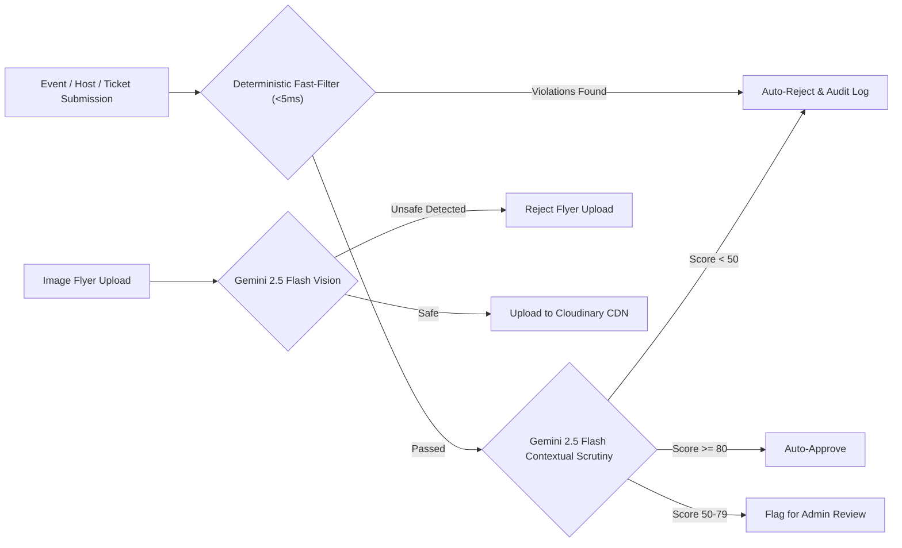

# 01. Multilingual Content & Visual Moderation

## 1. Technical Feature Design

### 🎯 Purpose
To autonomously safeguard the platform against abusive language, hate speech, local regional slang slurs, scam links, Ponzi promotions, and inappropriate flyers (nudity, violence, hate imagery) in real-time before content is published to public discovery feeds.

### ⚙️ System Architecture



### 🔍 Multilingual Fast-Filter Engine
* **Location:** [`server/src/moderation.ts`](file:///home/trivikramg/workspace/VibeCheck/server/src/moderation.ts) (`runFastFilter`)
* **Execution Time:** `< 5ms` per payload.
* **Language Support Matrix:**
  * **English:** Standard profanity, racial slurs, sexual harassment terms.
  * **Telugu (Romanized Transliterations):** Slurs and abusive colloquialisms (e.g., *dengu, dengutha, lanja, lanjakodaka, modda, moddalo, puku, pooku, erripuku, erripappa, gudha, guddha, bevarsi*).
  * **Telugu (Native Script):** *దెంగు, లంజ, లంజకొడుకు, ముండ, మొడ్డ, పూకు, ఎర్రిపూకు, గుద్ద, బేవార్స్, వెధవ*.
  * **Hindi / Urdu (Romanized & Devanagari):** *chutiya, bhenchod, madarchod, gandu, laude, loda, bhosadike, randi / चूतिया, बहनचोद, मादरचोद, गांडू, भोसड़ी*.
  * **Tamil, Kannada, Malayalam:** *thevidiya, otha, poda panni, bolimagane, huchanaayi, soole, myre, myran, kunna, pooru*.
* **Scam & Financial Fraud Regex Engine:**
  * Detects guaranteed return scams: `/\b(crypto\s*giveaway|free\s*bitcoin|double\s*your\s*money|100%\s*guaranteed\s*returns)\b/i`
  * Detects Telegram/WhatsApp betting leaks: `/\b(telegram\s*signal|whatsapp\s*leaks|casino\s*hack|betting\s*tips)\b/i`
  * Detects unauthorized commercial adult services: `/\b(escort\s*service|call\s*girls?)\b/i`

### 👁️ Multimodal Visual Poster Screening
* **Location:** [`server/src/moderation.ts`](file:///home/trivikramg/workspace/VibeCheck/server/src/moderation.ts) (`evaluateImageWithAI`) integrated with [`server/src/upload.ts`](file:///home/trivikramg/workspace/VibeCheck/server/src/upload.ts).
* **Vision Model:** `gemini-2.5-flash` with direct image URL / base64 inspection.
* **Screening Criteria:**
  * **Nudity & Sexual Content:** Explicit nudity, suggestive pornography, provocative escorts imagery.
  * **Violence & Gore:** Blood, physical assault, weapons, dangerous extremist symbols.
  * **Embedded Text Abuses:** Scam QR codes, abusive overlays, misleading logos.

### 📝 Audit Logging
Every evaluation is captured in `moderation_logs` table:
```sql
CREATE TABLE moderation_logs (
    id UUID PRIMARY KEY DEFAULT gen_random_uuid(),
    entity_type VARCHAR(50) NOT NULL, -- 'event', 'organizer', 'flyer', 'ticket'
    entity_id VARCHAR(255),
    submitted_by VARCHAR(255),
    content_payload JSONB NOT NULL,
    fast_filter_passed BOOLEAN DEFAULT true,
    ai_score INTEGER,
    ai_decision VARCHAR(50) NOT NULL, -- 'auto_approve', 'flag_for_review', 'auto_reject'
    flags JSONB DEFAULT '[]'::jsonb,
    ai_reason TEXT,
    created_at TIMESTAMP WITH TIME ZONE DEFAULT CURRENT_TIMESTAMP
);
```

---

## 2. Product Marketing & Demo Narrative

### 📢 Headline & Pitch
> **"Zero-Tolerance Local Safety: The Smartest Content Shield in City Socials."**

### 💡 The Problem with Legacy Platforms
Mainstream event apps and Facebook groups are flooded with spam, Telegram crypto signals, vulgar promoter posts, and misleading flyers. Manual moderation teams take 12–48 hours to review listings, leaving attendees exposed to toxic listings or fraudulent organizers.

### 🚀 The VibeCheck Solution
VibeCheck operates a dual-layer neural guardrail that inspects submissions in milliseconds:
1. **Understands Local Slang:** Whether an organizer types in English, Romanized Telugu (*"erripuk" / "lanja"*), or Hindi (*"chutiya"*), VibeCheck catches abusive slang instantly before it ever touches public discovery.
2. **AI Vision Flyer Screener:** Every uploaded flyer is inspected with Gemini Vision before hitting Cloudinary CDN. Posters containing adult content, violence, or fake ticketing QR codes are stopped immediately.
3. **No Red Tape for Good Organizers:** Authentic creators with clean descriptions are auto-approved in under 2 seconds.

### 🎯 Key Demo Talking Points
* *"Watch what happens when someone attempts to submit a fake crypto meetup with Telegram leak links — blocked in 4 milliseconds."*
* *"Even when someone tries to sneak regional Romanized swear words that English filters miss, VibeCheck's multilingual dictionary blocks it on the spot."*
* *"Flyers are automatically screened for safety before upload — ensuring 100% wholesome, safe, and family-friendly discovery."*
