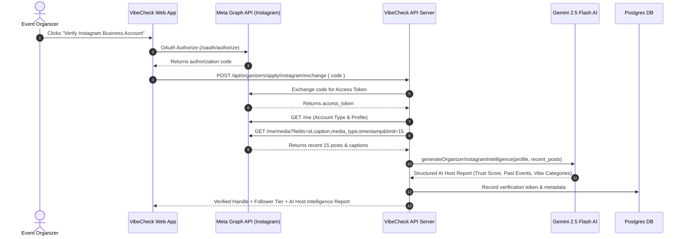

# 02. Instagram Host Intelligence & Verification

## 1. Technical Feature Design

### 🎯 Purpose
To eradicate anonymous scam organizers and fake accounts by verifying host identity through the **Instagram Meta Graph API** and performing autonomous AI intelligence profiling on recent media posts to calculate track record, vibe consistency, and host trust scores.

### ⚙️ System Architecture



### 📊 Instagram Profile & Media Ingestion
* **Endpoint:** `POST /api/organizers/apply/instagram/exchange` in [`server/src/organizer-apply.ts`](file:///home/trivikramg/workspace/VibeCheck/server/src/organizer-apply.ts).
* **Account Type Gate:** Only `BUSINESS` or `CREATOR` accounts are eligible. `PERSONAL` accounts are rejected with instructions to switch to a professional creator account.
* **Audience Tier Classification:**
  * `0 - 2,000 followers`: Micro / Seed Host
  * `2,001 - 4,000 followers`: Community Host
  * `4,001 - 10,000 followers`: Growth Host
  * `10,000+ followers`: Pro Host

### 🧠 Gemini 2.5 Flash Host Intelligence Engine
* **Location:** [`server/src/moderation.ts`](file:///home/trivikramg/workspace/VibeCheck/server/src/moderation.ts) (`generateOrganizerInstagramIntelligence`).
* **Input:** Profile details (handle, account name, followers count, media count) + recent 15 post captions and timestamps.
* **Output Schema:**
```typescript
export interface InstagramHostReport {
  estimated_past_events_count: number;         // Count of physical offline events detected in captions
  primary_vibe_categories: string[];           // E.g. ['Trekking', 'Fitness', 'Acoustic Music']
  audience_engagement_level: 'low' | 'moderate' | 'high' | 'viral';
  host_trust_score: number;                    // Score between 0 and 100
  summary_insights: string;                    // 2-3 sentence AI assessment
  has_hosted_offline_events: boolean;
  monetization_risk_level: 'low' | 'medium' | 'high';
}
```

---

## 2. Product Marketing & Demo Narrative

### 📢 Headline & Pitch
> **"Verified Creators Only: Powered by Instagram Media Intelligence."**

### 💡 The Problem with Legacy Platforms
Anyone can sign up with a throwaway Gmail address on ticketing portals, create an event called *"Vizag Sunset Party"*, collect UPI payments or attendee phone numbers, and vanish. Attendees are left stranded at fake venues with zero accountability.

### 🚀 The VibeCheck Solution
VibeCheck links directly with the creator’s active Instagram Business or Creator profile via official Meta Graph API:
1. **No Throwaway Accounts:** Organizers must authenticate their public creator page.
2. **AI Past Event Scrutiny:** Gemini AI analyzes the host's actual Instagram post history, counting real past offline meetups, workshops, and gatherings.
3. **Automated Host Trust Score:** If a host has an authentic history of hosting beach cleanups or acoustic jams, VibeCheck calculates a high trust score ($\ge 90$) and grants them organizer privileges instantly.
4. **Scam Prevention:** Accounts with zero community presence or high monetization risk are flagged for manual security screening before they can charge attendees.

### 🎯 Key Demo Talking Points
* *"Look at how VibeCheck pulls the host's live Instagram media and evaluates their track record automatically."*
* *"The system reads post captions, identifies that this host has conducted 3 previous trekking expeditions, assigns a 92/100 Trust Score, and auto-classifies their category as Trekking & Fitness."*
* *"This gives attendees 100% peace of mind that every VibeCheck host is a legitimate, verified local community creator."*
