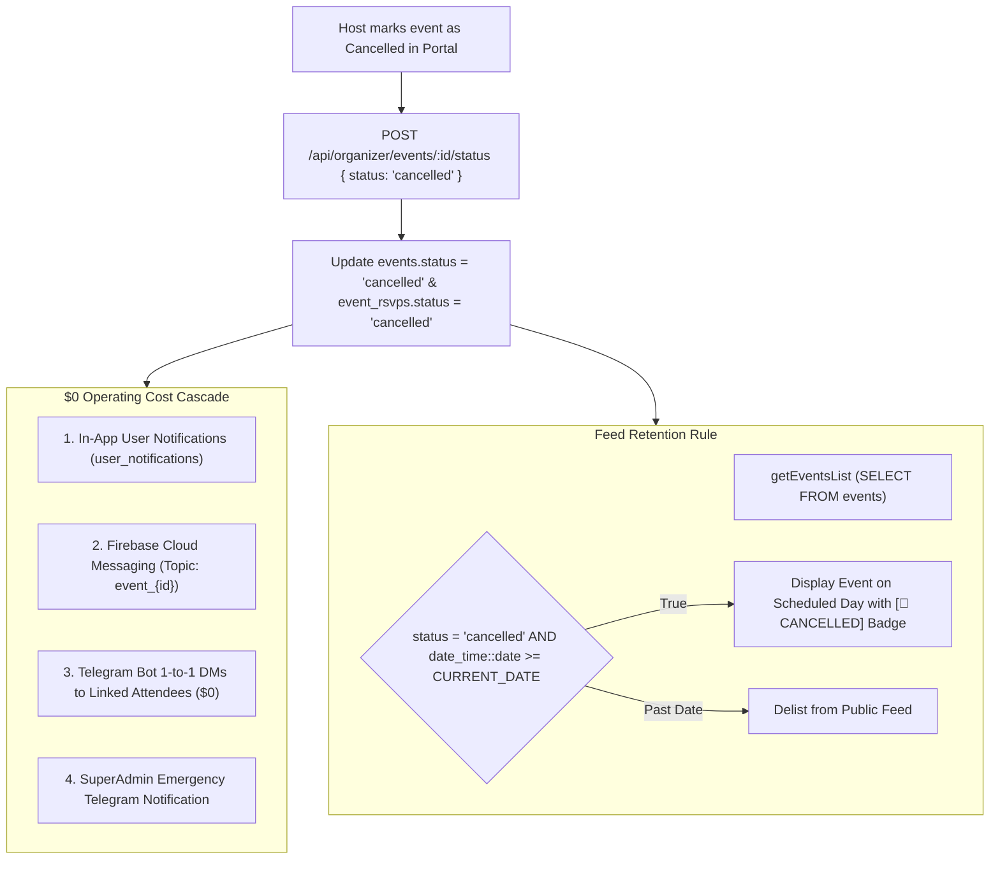

# 03. Event Cancellation Cascade & Discovery Feed Retention

## 1. Technical Feature Design

### 🎯 Purpose
To handle sudden event cancellations or host rescheduling gracefully without stranding attendees, without incurring expensive WhatsApp business messaging fees, and without causing confusion from events vanishing silently from the public feed.

### ⚙️ System Architecture



### 💰 Zero-Cost Notification Cascade Architecture
* **Rule:** **No paid WhatsApp Template API calls.** All automated broadcasts rely on 100% free protocols:
  1. **In-App User Notifications:** Stored in `user_notifications` table and rendered in user notification bell menu.
  2. **Telegram Bot DMs:** Sent via [`sendTelegramMessage`](file:///home/trivikramg/workspace/VibeCheck/server/src/telegram.ts) directly to attendees' linked Telegram chats with formatted markdown text:
     ```markdown
     ⚠️ *Event Cancellation Notice*
     
     Hi {Name},
     The organizer has cancelled *{Event Title}*.
     Your digital pass has been cancelled and voided. Please do not head to the venue.
     ```
  3. **Firebase Cloud Messaging (FCM):** Sent via [`sendFcmTopicBroadcast`](file:///home/trivikramg/workspace/VibeCheck/server/src/firebaseAdmin.ts) to `event_{id}` topic for instant web push.
  4. **SuperAdmin Bot Alarm:** High-priority Telegram alert sent to platform administrators.

### 📅 Public Feed Discovery Retention Policy
* **Implementation:** [`server/src/queries/events.ts`](file:///home/trivikramg/workspace/VibeCheck/server/src/queries/events.ts) (`getEventsList`):
  ```sql
  WHERE (
    status = 'approved' 
    OR status = 'housefull' 
    OR status = 'filling_fast' 
    OR (status = 'cancelled' AND date_time::date >= CURRENT_DATE) 
    OR status IS NULL
  )
  AND (status != 'ended' OR status IS NULL)
  AND (end_time >= NOW() OR (end_time IS NULL AND date_time >= NOW()) OR (status = 'cancelled' AND date_time::date >= CURRENT_DATE))
  ```
* **Frontend Rendering:**
  * Bento grid cards in [`web/src/app/dashboard/page.tsx`](file:///home/trivikramg/workspace/VibeCheck/web/src/app/dashboard/page.tsx) render a pulsating red `[🚨 CANCELLED]` badge.
  * Dedicated event page in [`web/src/app/event/[id]/EventDetailsClient.tsx`](file:///home/trivikramg/workspace/VibeCheck/web/src/app/event/%5Bid%5D/EventDetailsClient.tsx) replaces RSVP/pass CTA with a cancellation notice box and redirects attendees to explore other vibes.

---

## 2. Product Marketing & Demo Narrative

### 📢 Headline & Pitch
> **"Transparent Cancellations: No Disappearing Acts, Zero Ghosting."**

### 💡 The Problem with Legacy Platforms
When an event gets cancelled on conventional apps, the listing abruptly vanishes from the feed. Attendees who booked passes or planned their weekend arrive at the venue confused, believing the app suffered a glitch. Furthermore, messaging 500 attendees via SMS or WhatsApp costs platforms huge operational sums.

### 🚀 The VibeCheck Solution
1. **Never Disappears Unannounced:** If a host cancels on Saturday morning, the event remains on Saturday's discovery feed clearly stamped with a bold red `[🚨 CANCELLED]` badge so everyone knows the status immediately.
2. **Instant Multi-Channel Push:** Attendees receive an immediate push alert and Telegram DM warning them not to travel to the venue.
3. **Digital Pass Voiding:** The digital entry QR pass is instantly marked as invalid on their dashboard to prevent accidental entry at venues.
4. **$0 Operating Cost:** Powered by Telegram Bot API and Firebase Web Push, scaling seamlessly even for 10,000+ attendee broadcasts.

### 🎯 Key Demo Talking Points
* *"When an organizer marks an event cancelled, notice how the event doesn't mysteriously disappear — it stays right on today's feed with a prominent 'CANCELLED' banner."*
* *"Attendees instantly receive a Telegram alert and in-app push notification with zero latency."*
* *"This creates total transparency between hosts, attendees, and venues while saving thousands in SMS/WhatsApp messaging fees."*
