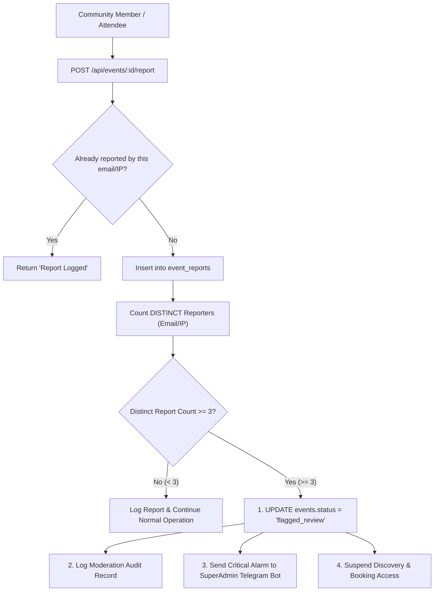

# 04. Community 3-Report Autonomous Freeze & Safety Alarm

## 1. Technical Feature Design

### 🎯 Purpose
To provide an autonomous peer-policing safety net that instantly freezes suspicious or fraudulent events when flagged by community members, preventing ticket scalping or venue fraud before human administrators even log in.

### ⚙️ System Architecture



### 🗄️ Database Schema & Indexes
* **Location:** [`db/init.sql`](file:///home/trivikramg/workspace/VibeCheck/db/init.sql) and [`server/src/scripts/migrate_guardrails.ts`](file:///home/trivikramg/workspace/VibeCheck/server/src/scripts/migrate_guardrails.ts).
```sql
CREATE TABLE IF NOT EXISTS event_reports (
    id UUID PRIMARY KEY DEFAULT gen_random_uuid(),
    event_id UUID NOT NULL REFERENCES events(id) ON DELETE CASCADE,
    reporter_email VARCHAR(255),
    reporter_ip VARCHAR(100),
    reason VARCHAR(100) NOT NULL, -- 'scam_fraud', 'fake_venue', 'offensive_content', 'safety_hazard', 'other'
    details TEXT,
    created_at TIMESTAMP WITH TIME ZONE DEFAULT CURRENT_TIMESTAMP
);

CREATE INDEX IF NOT EXISTS idx_event_reports_event_id ON event_reports (event_id);
CREATE INDEX IF NOT EXISTS idx_event_reports_created ON event_reports (created_at DESC);
```

### 🛡️ Autonomous Freeze Logic
* **Endpoint:** `POST /api/events/:id/report` in [`server/src/events.ts`](file:///home/trivikramg/workspace/VibeCheck/server/src/events.ts).
* **Distinct Counting Query:**
  ```sql
  SELECT COUNT(DISTINCT COALESCE(NULLIF(reporter_email, ''), reporter_ip))::int AS count 
  FROM event_reports 
  WHERE event_id = $1;
  ```
* **Actions on Reaching Threshold ($\ge 3$):**
  1. `events.status` is immediately updated to `'flagged_review'`.
  2. Public discovery queries (`getEventsList`) automatically exclude the event.
  3. New RSVP / ticket requests are blocked.
  4. Audit record inserted into `moderation_logs` with flag `community_3_reports_threshold_reached`.
  5. Telegram alert dispatched to SuperAdmin:
     ```
     🚨 CRITICAL SAFETY FREEZE: {Event Title}
     Event ID: {id} | City: {city} | Host: {organizer_email}
     Reason: Received 3+ community fraud/safety reports. Public listing and bookings suspended pending audit.
     ```

---

## 2. Product Marketing & Demo Narrative

### 📢 Headline & Pitch
> **"Self-Healing Platform: Powered by Crowd-Sourced Safety Alarms."**

### 💡 The Problem with Legacy Platforms
Scam events often stay live for days because customer support tickets sit in a queue waiting for manual triage. By the time an admin checks the ticket on Monday morning, the fraudster has already taken money from 50 attendees.

### 🚀 The VibeCheck Solution
1. **The 3-Strike Auto-Freeze Shield:** The instant 3 distinct community members report an event for fraudulent behavior or fake venue information, VibeCheck’s autonomous defense triggers.
2. **Instant Listing Suspension:** The event is automatically frozen and hidden from public discovery within milliseconds, cutting off further pass claims or payments.
3. **Emergency Telegram Bot Dispatch:** Platform administrators are pinged directly on their Telegram phones with one-tap audit controls to review or permanently ban the bad actor.

### 🎯 Key Demo Talking Points
* *"Watch how the crowd acts as an autonomous defense grid: three distinct reports instantly put the event on ice."*
* *"No human delay, no weekend support backlog — the platform protects attendees automatically."*
* *"SuperAdmins receive an instant Telegram bot ping with the full report context and host history."*
