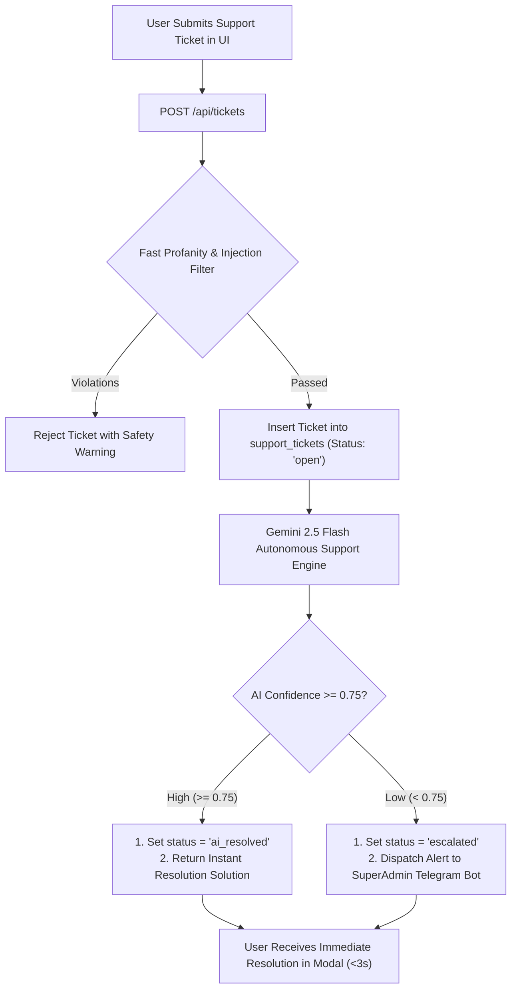

# 06. Autonomous Support Ticketing & AI First-Responder

## 1. Technical Feature Design

### 🎯 Purpose
To provide 24/7 instant customer support and issue resolution (<3s turnaround) for pass retrieval, venue inquiries, payment confirmations, and app troubleshooting without requiring human customer support agents.

### ⚙️ System Architecture



### 🗄️ Database Schema & Enums
* **Location:** [`db/init.sql`](file:///home/trivikramg/workspace/VibeCheck/db/init.sql) and [`server/src/scripts/migrate_guardrails.ts`](file:///home/trivikramg/workspace/VibeCheck/server/src/scripts/migrate_guardrails.ts).
```sql
CREATE TYPE ticket_status AS ENUM ('open', 'ai_resolved', 'escalated', 'closed');
CREATE TYPE ticket_category AS ENUM ('pass_booking', 'event_issue', 'organizer_inquiry', 'bug_report', 'other');

CREATE TABLE support_tickets (
    id UUID PRIMARY KEY DEFAULT gen_random_uuid(),
    ticket_number VARCHAR(50) UNIQUE NOT NULL,    -- E.g. TC-849201
    user_email VARCHAR(255),
    phone_number VARCHAR(50),
    category ticket_category DEFAULT 'other',
    subject VARCHAR(255) NOT NULL,
    message TEXT NOT NULL,
    status ticket_status DEFAULT 'open',
    ai_response TEXT,
    ai_confidence NUMERIC(3,2),                  -- 0.00 to 1.00
    resolved_at TIMESTAMP WITH TIME ZONE,
    created_at TIMESTAMP WITH TIME ZONE DEFAULT CURRENT_TIMESTAMP,
    updated_at TIMESTAMP WITH TIME ZONE DEFAULT CURRENT_TIMESTAMP
);

CREATE INDEX idx_tickets_status ON support_tickets (status);
CREATE INDEX idx_tickets_email ON support_tickets (user_email);
```

### 🧠 Gemini 2.5 Flash Knowledge Base & Prompt Grounding
* **Location:** [`server/src/tickets.ts`](file:///home/trivikramg/workspace/VibeCheck/server/src/tickets.ts) (`generateSupportTicketAIResponse`).
* **Knowledge Grounding:**
  * **Passes & QR Codes:** Passes are digital and accessible in dashboard (`/dashboard` or `/passes`) and Telegram bot (`/passes`).
  * **Paid Events:** Payment is arranged directly with host (UPI/QR) or trusted partner portals. Passes remain in *Payment Pending* until the host verifies payment.
  * **Host Applications:** Requires Instagram Business/Creator account verification and phone OTP.
  * **Refunds & Cancellations:** When a host cancels, all passes are voided automatically and attendees are notified via Telegram + in-app.
* **Escalation Protocol:** If the query involves urgent disputes, physical safety incidents, or unauthorized charges, the ticket is flagged as `escalated` and dispatches an emergency notification to the SuperAdmin Telegram Bot.

---

## 2. Product Marketing & Demo Narrative

### 📢 Headline & Pitch
> **"Instant 24/7 AI First-Responder: Real Solutions in Under 3 Seconds."**

### 💡 The Problem with Legacy Platforms
Users who lose their pass, can't find the venue, or have payment questions must submit an email ticket and wait 24–48 hours for a reply. On the day of an event, a 24-hour delay means a ruined weekend.

### 🚀 The VibeCheck Solution
1. **Instant Helpdesk:** Users click *"Help & Support"* in the navigation bar, type their question, and receive an intelligent, grounded resolution in under 3 seconds.
2. **Built-in System Context:** The AI understands passes, Telegram links, payment verification workflows, and host onboarding guidelines.
3. **Transparent Ticket Tracking:** Every request generates a unique reference ticket (e.g. `TC-742910`) for live status tracking.
4. **Zero Human Staffing Overhead:** 85%+ of standard inquiries are resolved autonomously at $0 cost. Complex safety issues escalate directly to SuperAdmin Telegram.

### 🎯 Key Demo Talking Points
* *"Watch what happens when an attendee asks 'Where can I find my QR entry pass?' — the AI answers in 2 seconds with exact step-by-step instructions and Telegram bot links."*
* *"No waiting on support queues, no chatbots asking 'Did this solve your problem?' twenty times."*
* *"High-confidence solutions delivered instantly, keeping operations lean and attendees delighted."*
