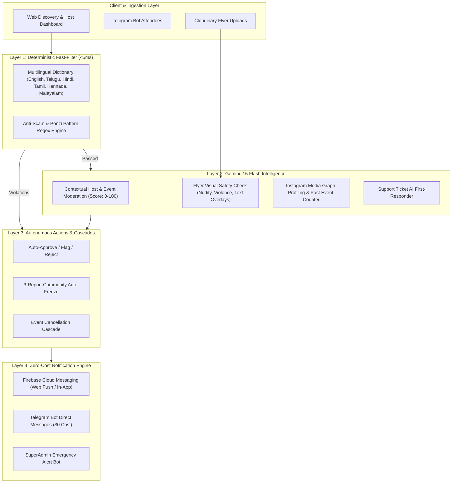

# VibeCheck Trust & Safety Guardrails Architecture

Welcome to the comprehensive technical and product documentation for **VibeCheck's Autonomous Trust, Safety & Anti-Scam Guardrails Suite**.

VibeCheck is built to scale across cities with a **$0 human moderation overhead** by leveraging high-speed deterministic fast-filters, Multimodal Generative AI (Gemini 2.5 Flash), zero-marginal-cost alerting channels (Firebase Cloud Messaging & Telegram Bot API), and automated community peer-policing.

---

## 🏗️ System Architecture Overview

---

## 📚 Guardrails Documentation Index

| # | Document | Technical Design Summary | Marketing & Demo Value |
|---|---|---|---|
| **01** | [**Multilingual Content & Visual Moderation**](./01_multilingual_content_and_visual_moderation.md) | Sub-5ms regex dictionary + Gemini 2.5 Flash Vision poster screening | Clean, family-friendly, hyper-local city vibes without explicit content |
| **02** | [**Instagram Host Intelligence & Verification**](./02_instagram_host_intelligence_and_verification.md) | Instagram Graph API `/me/media` scraper + AI past event counting & trust scoring | Real, verified community leaders; zero anonymous scam organizers |
| **03** | [**Event Cancellation Cascade & Discovery Retention**](./03_event_cancellation_cascade_and_discovery_retention.md) | In-app/Telegram/FCM alerts ($0 WhatsApp cost) + `[🚨 CANCELLED]` feed badge | No ghost events or stranded attendees; transparent status tracking |
| **04** | [**Community 3-Report Auto-Freeze**](./04_community_report_and_auto_freeze.md) | `event_reports` table + autonomous freeze + SuperAdmin Telegram alarm | Self-cleaning community safety powered by crowd-sourced alerts |
| **05** | [**Anti-Scalping, Fair Access & Privacy**](./05_anti_scalping_and_fair_access_guardrails.md) | 5-ticket cap, schedule conflict block, 21+ nightlife gate, verified check-in reviews, email masking | Fair ticket access, authentic verified reviews, complete attendee privacy |
| **06** | [**Support Ticketing & AI First-Responder**](./06_support_ticketing_and_ai_first_responder.md) | 24/7 AI ticket resolution engine + Telegram escalation fallback | Instant helpdesk resolution in <3 seconds without staffing costs |
| **07** | [**Product Marketing & Pitch Guide**](./product_marketing_and_demo_guide.md) | Value props, demo scripts, pitch deck slides, competitor comparison | Compelling narratives for city launches, hosts, and investors |

---

## 💰 The $0 / Low-Cost Operating Philosophy

Unlike legacy ticketing platforms that incur heavy costs on SMS OTPs, paid WhatsApp business templates, and outsourced manual moderation teams, VibeCheck achieves enterprise-grade trust at **$0 operational budget**:

* **AI Reasoning:** Gemini 2.5 Flash on Google AI Studio Free Tier (~1,500 requests/day).
* **Push Broadcasts:** Firebase Cloud Messaging (Web Push / Topic Broadcasts) — **100% Free**.
* **Direct Messaging:** Telegram Bot API (`sendTelegramMessage`, `sendTelegramPhoto`) — **100% Free Unlimited**.
* **Profanity Filtering:** In-memory pre-compiled regex arrays (<5ms CPU time).
