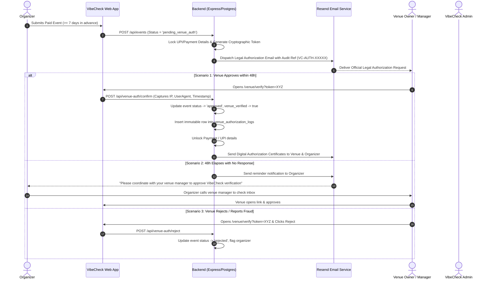

# Venue Verification & Legal Authorization Implementation Plan

## Objective
Implement an end-to-end **Venue Verification & Legal Authorization System** for VibeCheck. This ensures that every paid or large-scale event listed on the platform has explicit, legally binding authorization from the physical venue owner/manager, tying the organizer's verified identity (phone, email, brand) directly to the venue booking. It eliminates fake-event scams, protects attendees from fraudulent off-platform UPI payments, and provides an immutable legal audit trail.

---

## 1. Operational Rules & Verification Timeline

### A. Strict Advance Submission Rule (7-Day Lead Time)
* **Rule**: Any paid event (`is_paid === true`) must be submitted **at least 7 days (168 hours) in advance** of the event start date.
* **Frontend / Backend Validation**: If an organizer attempts to schedule a paid event less than 7 days ahead, the system rejects it with:
  > *"Paid events must be submitted at least 7 days in advance to allow sufficient time for venue authorization, security verification, and attendee ticket sales."*

### B. The 48-Hour Venue Response Window & Organizer Reminder
* **T = 0h (Submission)**: System sends the legal authorization email to the venue. Payment details on VibeCheck are locked.
* **T = 48h (No Response from Venue)**:
  - System automatically sends a reminder email & WhatsApp to the **Organizer**:
    > *"⏳ Venue Verification Pending: We have not yet received approval from [Venue Name] for your event '[Event Title]'. Please contact your venue manager/owner directly and ask them to check their inbox for the official verification email from VibeCheck."*
  - The Organizer Dashboard displays a prominent banner with a **"Resend Verification Email to Venue"** action button.
  - The event moves into the **Admin Review Queue** with the venue's official phone pre-populated for quick manual outreach if needed.

---

## 2. Core Architecture & Verification Flow



---

## 2. Detailed Technical Changes

### Phase 1: Database Schema & Migrations

#### `db/init.sql` & Server DB Startup (`server/src/queries/init.ts`)

1. **New Table: `venues` (Persistent Verified Venue Directory)**
   ```sql
   CREATE TABLE IF NOT EXISTS venues (
       id UUID PRIMARY KEY DEFAULT gen_random_uuid(),
       name VARCHAR(255) NOT NULL,
       city VARCHAR(100) NOT NULL,
       address TEXT,
       google_place_id VARCHAR(255),
       official_phone VARCHAR(50),
       official_whatsapp VARCHAR(50),
       official_email VARCHAR(255),
       manager_name VARCHAR(150),
       is_verified BOOLEAN DEFAULT false,
       created_at TIMESTAMP WITH TIME ZONE DEFAULT CURRENT_TIMESTAMP,
       updated_at TIMESTAMP WITH TIME ZONE DEFAULT CURRENT_TIMESTAMP
   );
   CREATE INDEX IF NOT EXISTS idx_venues_city_name ON venues (city, name);
   ```

2. **Alter Table: `events`**
   Add columns to store venue verification status, payment lock, and token:
   ```sql
   ALTER TABLE events
       ADD COLUMN IF NOT EXISTS venue_id UUID REFERENCES venues(id) ON DELETE SET NULL,
       ADD COLUMN IF NOT EXISTS venue_official_email VARCHAR(255),
       ADD COLUMN IF NOT EXISTS venue_official_phone VARCHAR(50),
       ADD COLUMN IF NOT EXISTS venue_section_hall VARCHAR(255),
       ADD COLUMN IF NOT EXISTS venue_verification_status VARCHAR(50) DEFAULT 'unverified', -- 'unverified' | 'pending_venue_auth' | 'verified' | 'rejected'
       ADD COLUMN IF NOT EXISTS venue_auth_token VARCHAR(255),
       ADD COLUMN IF NOT EXISTS venue_auth_token_expires_at TIMESTAMP WITH TIME ZONE,
       ADD COLUMN IF NOT EXISTS payment_details_locked BOOLEAN DEFAULT false,
       ADD COLUMN IF NOT EXISTS upi_id VARCHAR(100);
   ```

3. **New Table: `venue_authorization_logs` (Immutable Legal Audit Trail)**
   ```sql
   CREATE TABLE IF NOT EXISTS venue_authorization_logs (
       id UUID PRIMARY KEY DEFAULT gen_random_uuid(),
       event_id UUID NOT NULL REFERENCES events(id) ON DELETE CASCADE,
       audit_reference_id VARCHAR(100) UNIQUE NOT NULL, -- e.g. VC-AUTH-2026-XXXXX
       
       -- Venue Signer Info
       venue_name VARCHAR(255) NOT NULL,
       venue_official_email VARCHAR(255) NOT NULL,
       signer_ip_address VARCHAR(100) NOT NULL,
       signer_user_agent TEXT NOT NULL,
       
       -- Organizer Identity Snapshot
       organizer_brand_name VARCHAR(255),
       organizer_legal_name VARCHAR(255),
       organizer_email VARCHAR(255) NOT NULL,
       organizer_phone VARCHAR(50) NOT NULL,
       
       -- Event Snapshot at Signing
       event_title VARCHAR(255) NOT NULL,
       event_date_time TIMESTAMP WITH TIME ZONE NOT NULL,
       event_end_time TIMESTAMP WITH TIME ZONE,
       participant_limit INTEGER,
       is_paid BOOLEAN NOT NULL DEFAULT false,
       ticket_price NUMERIC(10,2) DEFAULT 0.00,
       
       -- Verification Result
       status VARCHAR(50) NOT NULL, -- 'authorized' | 'rejected'
       rejection_reason TEXT,
       signed_at TIMESTAMP WITH TIME ZONE DEFAULT CURRENT_TIMESTAMP
   );
   CREATE INDEX IF NOT EXISTS idx_venue_auth_logs_event ON venue_authorization_logs (event_id);
   ```

---

### Phase 2: Backend Implementation (`server`)

#### 1. `server/src/services/venueAuthEmail.ts`
- Generate responsive, legally binding HTML email containing:
  - **Audit Reference ID** (`VC-AUTH-YYYY-XXXX`)
  - **Organizer Verified Phone & Email** (from `admins` KYC record)
  - **Event Details** (Date/Time, Section, Capacity, Ticket Price)
  - **Legal Declaration & Consent Terms**
  - **Single-Use Encrypted Action URLs** (`/venue/verify?token=...&action=approve` and `action=reject`)
- Dispatch using **Resend SDK**.

#### 2. `server/src/routes/venueAuth.ts`
- `GET /api/venue-auth/details?token=...`:
  - Validates token & expiry (48 hours).
  - Returns event snapshot and organizer KYC details for the verification web screen.
- `POST /api/venue-auth/confirm`:
  - Validates token.
  - Captures `req.ip` and `req.headers['user-agent']`.
  - Generates audit record in `venue_authorization_logs`.
  - Sets `events.venue_verification_status = 'verified'`, `events.status = 'approved'`, `events.payment_details_locked = false`.
  - Invalidates the single-use token.
  - Sends confirmation receipt emails to Venue and Organizer.
- `POST /api/venue-auth/reject`:
  - Records rejection with optional reason.
  - Sets `events.venue_verification_status = 'rejected'`, `events.status = 'rejected'`.

#### 3. `server/src/queries/events.ts` & Immutability Guardrails
- **Creation Rule**: If `is_paid === true` or `participant_limit > 30`, initial status is set to `pending_venue_auth` and `payment_details_locked = true`.
- **Edit Immutability**:
  - Allow safe edits: `description`, `whatsapp_group_link`, `image_url`, `attendee_guide`.
  - Block or reset verification on critical edits: `location`, `date_time`, `is_paid`, `upi_id`. If altered, verification resets to `unverified` and locks payment details again.

---

### Phase 3: Frontend Implementation (`web`)

#### 1. Organizer Event Creation (`web/src/app/organizer/page.tsx`)
- Add fields for **Venue Official Email / Phone** and **Designated Hall / Area**.
- Display clear guidance: *"Paid events require direct confirmation from the venue owner before payment details are displayed to guests."*

#### 2. Public Legal Verification Page (`web/src/app/venue/verify/page.tsx`)
- Clean, trustworthy verification UI for the venue owner opening the email on phone or desktop.
- Displays:
  - VibeCheck Official Header with Audit Reference ID.
  - Full Organizer Card (Verified Brand, Phone, Email).
  - Full Event Card (Title, Exact Date/Time, Capacity, Paid/Free).
  - Explicit Legal Checkboxes:
    - [x] *I confirm this organizer has a valid reservation for this date/time.*
    - [x] *I authorize ticket sales / attendance up to the specified limit.*
  - **Confirm & Authorize** (Green button) and **Reject / Report Fraud** (Red button).

#### 3. Event Details Page (`web/src/app/event/[id]/EventDetailsClient.tsx`)
- Display **`🛡️ Venue Confirmed & Authorized`** trust badge when verified.
- If `payment_details_locked === true`:
  - Hide UPI ID / QR code.
  - Show banner: *"⏳ Venue authorization in progress. Payment details will be unlocked once confirmed by venue management."*
- If `unverified`:
  - Show caution banner: *"⚠️ Direct payment: Verify organizer credentials before transferring funds."*

#### 4. Admin Dashboard (`web/src/app/admin/page.tsx`)
- Add **"Venue Verification Queue"** tab.
- Shows pending requests with venue contact phone for manual quick-call verification and instant override.

---

## 3. Step-by-Step Implementation Order

1. **Step 1: DB Schema & Migration Scripts** — Add tables and columns in `db/init.sql` and `server/src/queries/init.ts`.
2. **Step 2: Legal Email Templates & Resend Service** — Create email generator and test delivery.
3. **Step 3: Backend API Endpoints** — Implement `/api/venue-auth/*` and event creation/update guards.
4. **Step 4: Frontend Verification Portal** — Build `/venue/verify` page with legal declaration UI.
5. **Step 5: Frontend Organizer & Event Page Guards** — Update event creation form, payment lock displays, and trust badges.
6. **Step 6: End-to-End Testing & Verification** — Test creation, email delivery, 1-click approval, immutability locks, and rejection flows.

---

## 4. Verification & Testing Checklist

- [ ] **Email Delivery**: Legal authorization email arrives with correct audit ID and organizer KYC.
- [ ] **Token Security**: Expired or reused tokens return proper HTTP 400/404 errors.
- [ ] **Audit Trail Integrity**: `venue_authorization_logs` records signer IP, user agent, and timestamp.
- [ ] **Payment Protection**: UPI details remain hidden until the venue approves the event.
- [ ] **Immutability Check**: Editing date/venue on an approved event immediately revokes the verified badge and locks payments.
