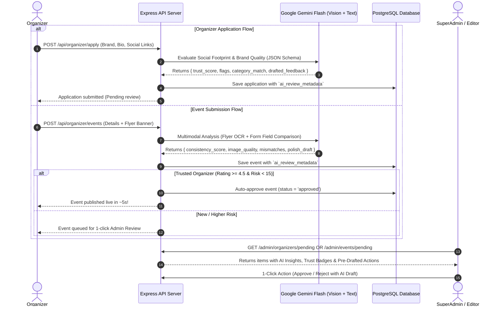
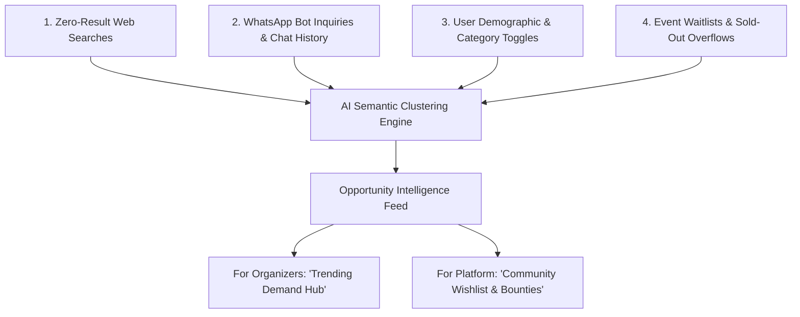

# VibeCheck AI Architecture & Implementation Plan
**A Comprehensive Guide to AI-Powered Approvals, Demand Intelligence, and Community Matchmaking**

**Document Version:** 2.0  
**Target Milestone:** Production AI Capabilities (Approvals, Demand Engine, WhatsApp Concierge, and Creator Co-Pilot)  
**Location:** `docs/pending/ai_organizer_and_event_approval_plan.md`  
**Core Technologies:** Google Gemini 1.5/2.0 Flash (Multimodal + Text), PostgreSQL + `pgvector` (`vector(1024)`), WhatsApp Meta Cloud API, Express.js Backend, Next.js Frontend

---

## 1. Executive Summary & Vision

VibeCheck leverages **Google Gemini Flash** and **PostgreSQL vector embeddings** not as superficial chatbots, but as deep operational and social infrastructure.

### Core AI Pillars:
1. **AI Organizer & Event Quality Shield:** Automated brand vetting, multimodal flyer forensics (OCR vs. form consistency), and graduated trust auto-approvals.
2. **"What Your City Wants" Demand Intelligence:** Semantic clustering of zero-result searches and WhatsApp queries to discover unmet event demand and provide organizers with pre-validated event concepts.
3. **Autonomous City Event Scout (Cold-Start Engine):** Discovers and drafts hyperlocal community events from local subreddits and social channels for 1-click admin publishing.
4. **Proactive WhatsApp Matchmaker & 24/7 Concierge:** Contextual weekend nudges based on user demographic tags, natural language WhatsApp booking, and real-time RAG event Q&A.
5. **Creator AI Co-Pilot:** Scheduling clash detection, 1-click flyer-to-event autofill, and instant rain/emergency broadcast drafting.
6. **Social & Networking Matcher:** Solo-goer buddy pairing and post-event attendee connection prompts.

---

## 2. Pillar 1: AI Organizer & Event Approval Pipeline



### Detailed Inspection Criteria:
* **Multimodal Flyer Forensics:** Reads text inside the image. Flags discrepancies if the flyer says *"Saturday, 7 PM at Beach Shack"* but the form says *"Sunday, 9 AM"*.
* **Image Quality & Safety:** Validates banner resolution, checks for watermarks/copyright issues, and screens for inappropriate imagery.
* **Organizer Digital Footprint:** Assesses email domain reputation, analyzes Instagram/Facebook link validity, and checks for spam patterns.
* **1-Click Admin Action:** When an admin rejects an application, the modal is pre-populated with a polite, constructive AI-generated reason.

---

## 3. Pillar 2: "What Your City Wants" (Demand & Opportunity Intelligence)



### Key Capabilities:
1. **Unmet Search Clustering:** Groups disparate searches (`"catan night"`, `"chess cafe"`, `"boardgames this weekend"`) into concrete opportunities like **"Casual Board Game Socials"**.
2. **Organizer Opportunity Hub (`/organizer/opportunities`):**
   * Shows high-demand, low-competition event concepts in their city.
   * Includes projected attendance, optimal day/timing, and suggested pricing.
   * Features a **"Create This Event with AI Draft"** button that pre-fills the event details.
3. **The Community Wishlist & Bounties:**
   * Attendees can post and upvote event concepts (e.g. *"Silent Beach Disco in Rushikonda"* — 86 upvotes).
   * When an organizer claims and creates the event, all 86 upvoters receive an automated WhatsApp notification $\rightarrow$ **Guaranteed Day-1 sellout with zero marketing spend.**

---

## 4. Pillar 3: Proactive WhatsApp Concierge & Matchmaker

```
┌────────────────────────────────────────────────────────────────────────┐
│                        WHATSAPP MATCHMAKING FLOW                       │
├────────────────────────────────────────────────────────────────────────┤
│ 1. Friday 11:00 AM Cron Trigger                                        │
│ 2. Analyze User Vector (Categories, Age Group, Past RSVPs, City)       │
│ 3. Match against High-Scoring Upcoming Events in Next 72 Hours         │
│ 4. Dispatch Hyper-Personalized 1-to-1 Conversational WhatsApp Nudge:   │
│                                                                        │
│    "Hey Rohit! We noticed you love Acoustic Music & Specialty Coffee.  │
│     Bay View Cafe is hosting an intimate sunset acoustic set this      │
│     Saturday at 6 PM. 12 spots left — reply 'YES' to lock your pass!"  │
│                                                                        │
│ 5. User replies: "YES"                                                 │
│ 6. AI Agent confirms RSVP, issues pass code, and delivers GCal link!   │
└────────────────────────────────────────────────────────────────────────┘
```

### 24/7 Event FAQ Assistant (Instant RAG):
Attendees can reply to any ticket message on WhatsApp with questions like:
* *"Is parking available for cars?"*
* *"Can I bring my pet?"*
* *"What is the dress code?"*
The RAG agent answers immediately using the organizer's event briefing and venue metadata.

---

## 5. Pillar 4: Autonomous City Event Scout (Cold-Start Engine)

* **Hyperlocal Web Scout:** Monitors city subreddits (e.g., `r/Visakhapatnam`, `r/bangalore`), public event pages, and university bulletin boards.
* **Auto-Drafting:** Automatically extracts event name, category, venue, dates, and banner image.
* **Admin Review Queue:** Places discovered events in a dedicated *"Discovered Events"* tab in the Admin Portal for 1-click verification, ensuring no new city ever feels empty.
* **AI "Local Currents" Editorial Digest:** Generates a weekly city culture guide for the `/local-currents` tab summarizing the top weekend vibes.

---

## 6. Pillar 5: Creator AI Co-Pilot

* 🗓️ **Scheduling & Clash Detector:** Warns organizers during creation if competing events in the same category and neighborhood are scheduled at the same time.
* ✍️ **AI Broadcast Copywriter:** Generates engaging WhatsApp broadcast drafts (FOMO alerts, parking guides, weather updates) with 1 click in the Creator CRM.
* 🌧️ **1-Click Emergency Rain / Venue Shift Dispatch:** Organizers type *"Rain started, moving indoors to Hall B"* $\rightarrow$ AI immediately formats and dispatches clear, panic-free WhatsApp notifications with updated venue directions.

---

## 7. Database Schema Extensions

Add the following columns and tables to `db/init.sql`:

```sql
-- 1. AI Review Metadata for Admins (Organizers)
ALTER TABLE admins 
ADD COLUMN IF NOT EXISTS ai_review_metadata JSONB DEFAULT NULL;

-- 2. AI Review Metadata for Events
ALTER TABLE events 
ADD COLUMN IF NOT EXISTS ai_review_metadata JSONB DEFAULT NULL;

-- 3. City Search & Demand Intelligence Logs
CREATE TABLE IF NOT EXISTS search_demand_logs (
    id UUID PRIMARY KEY DEFAULT gen_random_uuid(),
    city VARCHAR(100) NOT NULL,
    query TEXT NOT NULL,
    category_hint VARCHAR(100),
    results_count INTEGER DEFAULT 0,
    user_email VARCHAR(255),
    created_at TIMESTAMP WITH TIME ZONE DEFAULT CURRENT_TIMESTAMP
);

CREATE INDEX idx_search_demand_city ON search_demand_logs(city, created_at DESC);

-- 4. Community Wishlist / Event Requests
CREATE TABLE IF NOT EXISTS event_wishlists (
    id UUID PRIMARY KEY DEFAULT gen_random_uuid(),
    city VARCHAR(100) NOT NULL,
    title VARCHAR(255) NOT NULL,
    category event_category NOT NULL DEFAULT 'General',
    description TEXT,
    upvotes_count INTEGER DEFAULT 1,
    upvoted_by JSONB DEFAULT '[]'::jsonb, -- list of user emails/phones
    status VARCHAR(50) DEFAULT 'open',    -- 'open' | 'claimed' | 'completed'
    claimed_by_organizer VARCHAR(255) REFERENCES admins(email),
    created_at TIMESTAMP WITH TIME ZONE DEFAULT CURRENT_TIMESTAMP
);

CREATE INDEX idx_wishlists_city ON event_wishlists(city, upvotes_count DESC);
```

---

## 8. Operating Costs & Economic Feasibility

### Google Gemini API Pricing (Gemini 1.5 / 2.0 Flash)

| Operation | Typical Tokens | Cost per Unit | Monthly Cost (Early Launch: ~1,000 Ops) |
| :--- | :--- | :--- | :--- |
| **Organizer Review** | ~700 tokens | ~$0.0001 (~₹0.008) | **$0.00** *(Under Free Tier)* |
| **Event Multimodal Review** | ~1,050 tokens (incl. Flyer) | ~$0.00015 (~₹0.012) | **$0.00** *(Under Free Tier)* |
| **WhatsApp Nudge / RAG Q&A** | ~600 tokens | ~$0.00008 (~₹0.006) | **$0.00** *(Under Free Tier)* |
| **Weekly Demand Clustering** | ~5,000 tokens / batch | ~$0.0008 (~₹0.065) | **$0.00** *(Under Free Tier)* |

* **Google Free Tier:** Up to **1,500 requests per day at $0.00**.
* **Paid Scale Fallback:** Reviewing 1,000 events + 1,000 organizer applications costs **less than ₹25 / month (~$0.30)**.

---

## 9. Phased Implementation Roadmap

```
Phase 1: AI Organizer & Event Approval Pipeline (Sprint 1)
├── Update db/init.sql with ai_review_metadata columns
├── Build server/src/ai-review.ts (Gemini Flash Multimodal + Text)
├── Wire background review trigger in organizer-apply.ts & organizer.ts
└── Add AI Trust Badges & 1-Click Decision Modals in Admin Organizers & Events UI

Phase 2: Proactive WhatsApp Matchmaker & RAG Concierge (Sprint 2)
├── Enhance server/src/cron.ts with vector demographic matching
├── Implement natural language RSVP confirmations via WhatsApp webhook
└── Connect 24/7 Event FAQ RAG assistant for ticket holders

Phase 3: Demand Intelligence & Community Wishlists (Sprint 3)
├── Implement search_demand_logs logging on web search and WhatsApp
├── Build weekly Gemini clustering worker to synthesize City Opportunity reports
├── Add "Trending City Demand" tab in Organizer Dashboard
└── Launch Community Wishlist & Upvoting UI on Web

Phase 4: Creator AI Co-Pilot & Autonomous City Scout (Sprint 4)
├── Add 1-Click Flyer-to-Event autofill in Event Creator form
├── Add Scheduling Clash Detector & Broadcast Copywriter
└── Implement Autonomous Event Scout for new city cold-start expansion
```

---

## 10. Verification & Test Plan

1. **Organizer Application Test:**
   * Submit legitimate brand profile $\rightarrow$ Verify `trust_score > 85` and positive summary.
   * Submit temporary burner email with generic text $\rightarrow$ Verify `trust_score < 40` and risk flags.
2. **Multimodal Flyer Consistency Test:**
   * Submit flyer with matching date/time $\rightarrow$ Verify `is_consistent: true`.
   * Submit flyer with mismatched date/venue $\rightarrow$ Verify AI flags scheduling discrepancy.
3. **Auto-Approval Policy Test:**
   * Test submission from organizer with rating $\ge 4.5$ and risk $< 15$ $\rightarrow$ Verify immediate `status = 'approved'`.
4. **Demand Intelligence Test:**
   * Simulate 20 searches for *"Board games"* $\rightarrow$ Run clustering worker $\rightarrow$ Verify generated opportunity card in Organizer Hub.
5. **WhatsApp Matchmaker Test:**
   * Trigger matchmaker cron for a user with `Sports` preference $\rightarrow$ Verify targeted conversational message delivery.
