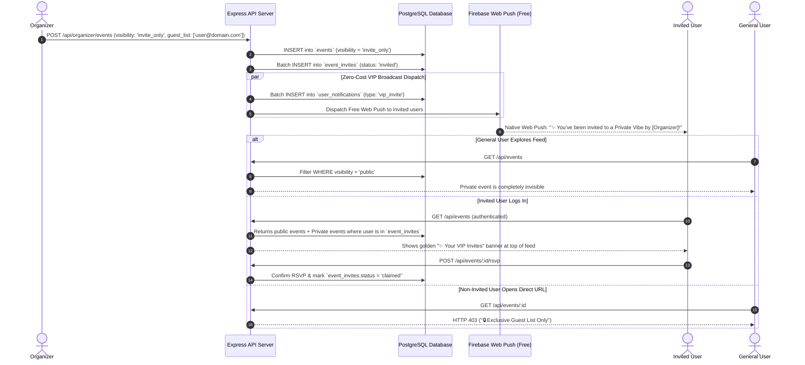

# VibeCheck Invite-Only Events & In-App VIP Broadcasts Implementation Plan

**Document Version:** 1.0  
**Target Feature:** Private / Invite-Only Events & Zero-Cost VIP Notifications  
**Location:** `docs/pending/invite_only_events_implementation_plan.md`  
**Core Technologies:** PostgreSQL, Express.js Backend, Next.js Frontend, Firebase Cloud Messaging (FCM), In-App Notifications Engine

---

## 1. Executive Summary & Problem Solved

### The Feature:
Allows organizers to create **Exclusive / Invite-Only Events** (private acoustic sessions, founders' dinners, secret listening parties, members-only workshops) with a designated guest list (emails or phone numbers).

### Key Rules:
1. **Public Feed Isolation:** General users **cannot see** private events on the public dashboard, search, or calendar.
2. **Zero-Cost VIP Notification:** Instead of paying for WhatsApp/SMS, invited users receive **Instant In-App Notifications (Notification Bell) + Free Firebase Web Push (FCM)**.
3. **Personalized VIP Feed:** When an invited user logs in, a dedicated **"✨ Your VIP Invites"** section appears at the top of their dashboard.
4. **Direct Link Protection:** If a non-invited user navigates to `/event/[id]`, they see a sleek **"🔒 Guest List Only"** screen with access restricted.
5. **100% Free Operation ($0.00 Cost):** Uses existing PostgreSQL notification tables and Firebase Web Push with zero third-party messaging charges.

---

## 2. High-Level System Architecture & Flow



---

## 3. Database Schema Migrations

Add the following ENUM, columns, and tables to `db/init.sql`:

```sql
-- 1. Add Event Visibility ENUM
DO $$ BEGIN
    CREATE TYPE event_visibility AS ENUM ('public', 'invite_only');
EXCEPTION
    WHEN duplicate_object THEN null;
END $$;

-- 2. Add visibility column to events table
ALTER TABLE events 
ADD COLUMN IF NOT EXISTS visibility event_visibility DEFAULT 'public';

-- 3. Guest List Table (Whitelisted Attendees)
CREATE TABLE IF NOT EXISTS event_invites (
    id UUID PRIMARY KEY DEFAULT gen_random_uuid(),
    event_id UUID NOT NULL REFERENCES events(id) ON DELETE CASCADE,
    user_email VARCHAR(255) NOT NULL,
    phone_number VARCHAR(50),
    status VARCHAR(50) DEFAULT 'invited',       -- 'invited' | 'opened' | 'claimed' | 'declined'
    invited_at TIMESTAMP WITH TIME ZONE DEFAULT CURRENT_TIMESTAMP,
    claimed_at TIMESTAMP WITH TIME ZONE,
    metadata JSONB DEFAULT '{}'::jsonb,
    UNIQUE(event_id, user_email)
);

CREATE INDEX IF NOT EXISTS idx_event_invites_user ON event_invites (user_email);
CREATE INDEX IF NOT EXISTS idx_event_invites_event ON event_invites (event_id);
CREATE INDEX IF NOT EXISTS idx_events_visibility ON events (visibility);
```

---

## 4. Backend Implementation Specifications

### A. Event Creation with Guest List (`server/src/organizer.ts`)
* In `createOrganizerEventHandler`:
  1. Extract `visibility` (`'public'` or `'invite_only'`) and `guest_list` (array of emails).
  2. Insert into `events` table with `visibility = $visibility`.
  3. If `visibility === 'invite_only'`:
     * Insert records into `event_invites` for each email in `guest_list`.
     * Trigger background in-app VIP notifications:
       ```typescript
       // Dispatch In-App Notification + FCM Push
       await Promise.allSettled(
         guestList.map(email =>
           createUserNotification(pool, {
             userEmail: email,
             title: `✨ VIP Invite: ${event.title}`,
             message: `${organizerBrand} added you to the exclusive guest list for '${event.title}'. Claim your spot!`,
             type: 'vip_invite',
             link: `/event/${event.id}`,
             metadata: { event_id: event.id, organizer_name: organizerBrand }
           })
         )
       );
       ```

### B. Feed Query Filtering (`server/src/queries/events.ts`)
Update `getEventsList` and `searchEventsByVector`:
```sql
SELECT * FROM events
WHERE (status = 'approved' OR status IS NULL)
  AND (
    visibility = 'public' OR visibility IS NULL
    -- Reveal invite-only events ONLY if authenticated user is in event_invites:
    OR (
      visibility = 'invite_only' AND EXISTS (
        SELECT 1 FROM event_invites 
        WHERE event_id = events.id AND LOWER(user_email) = LOWER($userEmail)
      )
    )
  )
ORDER BY date_time ASC;
```

### C. Direct Event Page Authorization (`server/src/events.ts`)
In `getSingleEventHandler`:
* If `event.visibility === 'invite_only'`:
  * Check if `req.query.email` or session user is:
    1. In `event_invites` for this event, **OR**
    2. The organizer who created the event (`event.organizer_email`), **OR**
    3. A SuperAdmin.
  * If unauthorized, return `403` with `{ success: false, is_private: true, error: "This is an exclusive invite-only vibe." }`.

### D. User VIP Invites Endpoint (`GET /api/user/vip-invites`)
* Returns all active, unredeemed private events the logged-in user is invited to.

---

## 5. Frontend & UI/UX Specifications

### 1. Organizer Event Creator Form (`web/src/app/organizer/create/page.tsx`)
* Add a **"Privacy & Access"** Section:
  * Radio options:
    * 🌍 **Public Event (Default):** Listed on explore feed for everyone.
    * 🔒 **Invite-Only / Private Vibe:** Only invited guest list can see and RSVP.
* When **Invite-Only** is selected, show:
  * Textarea for comma/newline-separated emails (`alex@gmail.com, priya@outlook.com`).
  * Quick-picker: *"Invite all 24 attendees from my previous event"*.
  * Helper note: *"Invited users will receive an instant In-App Notification and Web Push alert."*

### 2. User Dashboard VIP Carousel (`web/src/app/dashboard/page.tsx`)
* For logged-in users with active invites, display a glowing VIP banner above the main feed:
```
┌────────────────────────────────────────────────────────────────────────┐
│  ✨ YOU HAVE 1 EXCLUSIVE INVITATION                                    │
│  Curated for you by Bay Wave Acoustics                                 │
├────────────────────────────────────────────────────────────────────────┤
│  [ 🎟️ Secret Sunset Rooftop Jam • Vizag • Friday, 6:30 PM ]            │
│  [ Claim Your VIP Spot → ]                                             │
└────────────────────────────────────────────────────────────────────────┘
```

### 3. In-App Notification Bell (`web/src/components/NotificationBell.tsx`)
* Render `'vip_invite'` notifications with a golden sparkle badge, organizer brand name, and direct link to claim their pass.

### 4. Private Event Lock Screen (`web/src/app/event/[id]/EventDetailsClient.tsx`)
* If an unauthorized user attempts to view a private event direct link:
```
┌────────────────────────────────────────────────────────────────────────┐
│                                                                        │
│                                🔒                                      │
│                      EXCLUSIVE GUEST LIST ONLY                         │
│                                                                        │
│   This vibe is a private, invite-only gathering curated by             │
│   Bay Wave Acoustics. Access is strictly limited to invited guests.   │
│                                                                        │
│                   [ Back to Explore Public Vibes ]                     │
│                                                                        │
└────────────────────────────────────────────────────────────────────────┘
```

---

## 6. Phased Implementation Roadmap

```
Sprint 1: Database & Backend Access Control
├── Add event_visibility ENUM & visibility column to events table
├── Create event_invites table in db/init.sql
├── Update getEventsList and getSingleEventHandler with invite authorization
└── Add GET /api/user/vip-invites endpoint

Sprint 2: Organizer Creation & In-App VIP Dispatch
├── Add Invite-Only toggle & guest list input in Organizer Event Creator form
├── Connect batch in-app notification & FCM push dispatch upon event creation
└── Add guest list RSVP tracker in Organizer Event Management dashboard

Sprint 3: User Experience & VIP Dashboard Banner
├── Build "✨ Your VIP Invites" banner on /dashboard
├── Add VIP styling to In-App Notification Bell
└── Build sleek "🔒 Guest List Only" 403 Lock Screen for unauthorized direct links
```

---

## 7. Verification & Test Plan

1. **Privacy & Feed Isolation Test:**
   * Organizer creates `invite_only` event with guest `vip@vibecheck.space`.
   * Unauthenticated visitor browses `/dashboard` $\rightarrow$ Event is **hidden**.
   * Other user `regular@vibecheck.space` logs in $\rightarrow$ Event is **hidden**.
2. **VIP Discovery Test:**
   * `vip@vibecheck.space` logs in $\rightarrow$ Golden VIP banner appears on `/dashboard`.
   * Notification Bell shows unread `"✨ VIP Invite"` alert.
3. **RSVP & Claim Test:**
   * VIP clicks *"Claim Your VIP Spot"* $\rightarrow$ Passes issued, `event_invites.status = 'claimed'`.
4. **Direct Link Security Test:**
   * Non-invited user pastes `/event/[id]` link $\rightarrow$ Sees 403 Private Lock Screen.
