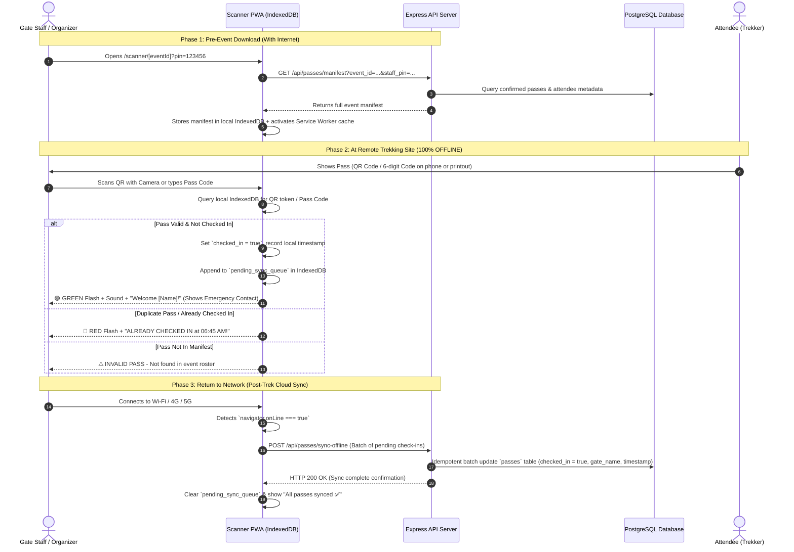

# VibeCheck Offline Gate Scanner & Remote Site Verification Implementation Plan

**Document Version:** 1.0  
**Target Feature:** Offline-First Ticket Scanning & Remote Trekking Verification Engine  
**Location:** `docs/pending/offline_gate_scanner_implementation_plan.md`  
**Core Technologies:** Next.js PWA, IndexedDB (idb-keyval / Dexie or native), Service Workers, PostgreSQL, Express.js Backend

---

## 1. Executive Summary & Problem Solved

### The Problem:
Events taking place in remote, wilderness, or low-connectivity zones (e.g., hill treks, mountain campsites, forest trails, beach parties, basement venues) have **zero cellular network or Wi-Fi**.
Currently, [`GateScannerPage`](file:///home/trivikramg/workspace/VibeCheck/web/src/app/scanner/[eventId]/page.tsx) issues a live network request (`POST /api/passes/verify`) for every scan. In a no-internet scenario, scanning fails with a network error.

### The Solution:
An **Offline-First Gate Scanner Engine** that:
1. **Pre-caches the event manifest** (all pass codes, QR tokens, attendee names, emergency contacts) to browser `IndexedDB` while the organizer has internet (at home or base camp).
2. **Runs 100% offline at the gate**:
   - Performs instant local QR / Pass Code matching (< 50ms).
   - Validates authenticity and flags duplicate check-ins locally.
   - Allows offline manual search if an attendee's phone dies on the trek.
   - Logs check-ins to an offline sync queue with precise ISO timestamps and gate metadata.
3. **PWA App Shell Caching**: Uses a Service Worker to cache HTML, JavaScript, camera libraries (`html5-qrcode`), and audio feedback files so the scanner loads even in complete Airplane Mode.
4. **Automatic Cloud Reconciliation**: As soon as internet connectivity is detected (or via manual "Sync Now" button), the scanner uploads the pending check-in queue to the server idempotently.

---

## 2. System Architecture & Flow



---

## 3. Storage & IndexedDB Data Model

The scanner uses `IndexedDB` with three object stores per event:

### Store 1: `event_manifest`
Key: `event_id`
```json
{
  "event_id": "trek_2026_01",
  "title": "Araku Valley Monsoon Trek",
  "downloaded_at": "2026-09-20T05:00:00.000Z",
  "staff_pin": "981245",
  "gate_name": "Trail Head Checkpoint",
  "total_passes": 45,
  "passes": {
    "qr_token_abc123": {
      "pass_id": "pass_uuid_1",
      "rsvp_id": "rsvp_uuid_1",
      "pass_code": "VB-8921",
      "qr_token": "qr_token_abc123",
      "attendee_name": "Rahul Sharma",
      "phone_number": "+919876543210",
      "emergency_contact": "+919811223344 (Father)",
      "medical_notes": "Asthma inhaler in backpack",
      "checked_in": false,
      "checked_in_at": null,
      "checked_in_by": null
    }
  }
}
```

### Store 2: `pending_sync_queue`
Key: Auto-increment ID
```json
{
  "id": 1,
  "event_id": "trek_2026_01",
  "pass_id": "pass_uuid_1",
  "qr_token": "qr_token_abc123",
  "pass_code": "VB-8921",
  "attendee_name": "Rahul Sharma",
  "checked_in_at": "2026-09-20T06:32:15.000Z",
  "gate_name": "Trail Head Checkpoint",
  "synced": false
}
```

### Store 3: `scanner_settings`
```json
{
  "audio_feedback": true,
  "haptic_feedback": true,
  "offline_mode_forced": false,
  "last_synced_at": "2026-09-20T05:00:00.000Z"
}
```

---

## 4. API Endpoints Specification

### 1. Download Manifest for Offline Use
* **Route:** `GET /api/passes/manifest`
* **Query Params:** `event_id`, `staff_pin`
* **Authorization:** Staff PIN or Organizer JWT Session
* **Response:**
  ```json
  {
    "success": true,
    "event": {
      "id": "trek_2026_01",
      "title": "Araku Valley Monsoon Trek",
      "date": "2026-09-20T06:00:00Z",
      "location": "Araku Valley, AP"
    },
    "gate_name": "Main Gate",
    "total_passes": 45,
    "manifest": [
      {
        "pass_id": "uuid-1",
        "pass_code": "VB-8921",
        "qr_token": "tok_99128",
        "attendee_name": "Rahul Sharma",
        "phone_number": "+919876543210",
        "checked_in": false,
        "checked_in_at": null
      }
    ]
  }
  ```

### 2. Batch Offline Reconciliation
* **Route:** `POST /api/passes/sync-offline`
* **Headers:** `Content-Type: application/json`
* **Body:**
  ```json
  {
    "event_id": "trek_2026_01",
    "staff_pin": "981245",
    "checkins": [
      {
        "pass_id": "uuid-1",
        "qr_token": "tok_99128",
        "pass_code": "VB-8921",
        "checked_in_at": "2026-09-20T06:32:15.000Z",
        "gate_name": "Trail Head Checkpoint"
      }
    ]
  }
  ```
* **Database Action (PostgreSQL):**
  Uses `UPDATE passes SET checked_in = true, checked_in_at = COALESCE(passes.checked_in_at, $timestamp), checked_in_by = $gate_name WHERE event_id = $eventId AND (qr_token = $qr OR pass_code = $code)`.
  *Idempotent: If already checked in on another device, preserves the earlier timestamp.*

---

## 5. Frontend Scanner Enhancements ([`GateScannerPage`](file:///home/trivikramg/workspace/VibeCheck/web/src/app/scanner/[eventId]/page.tsx))

### A. Network & Offline Status Banner
* Real-time network indicator badge:
  * 🟢 **Online Mode** (Live server sync)
  * 🟠 **Offline Mode** (IndexedDB active, `X` pending check-ins in queue)
  * 🔵 **Syncing...** (Uploading pending check-ins)

### B. "Download for Offline" Button & Auto-Prefetch
* Prominent banner when opening with network:
  *"Preparing for a remote location? 📥 Tap here to cache 45 attendee passes for offline scanning."*

### C. Offline Verification Logic Flow
1. On QR scan / manual code entry:
2. Attempt live API `POST /api/passes/verify`.
3. If fetch fails (or `navigator.onLine === false`):
   * Switch transparently to **Offline Engine**.
   * Query IndexedDB `passes` by `qr_token` or `pass_code`.
   * Check if already checked in locally.
   * Update IndexedDB pass state and append to `pending_sync_queue`.
   * Play audio & haptic feedback.
   * Render success modal with emergency contact & group size info.

### D. Offline Search Drawer
* Works without internet by querying the local IndexedDB roster via regex / sub-string matching on Name, Phone, or Pass Code.
* Allows manual one-tap "Check In" button in offline mode.

---

## 6. Service Worker & PWA Caching Strategy

To ensure the scanner can open when the phone has **zero signal**:
1. Register Service Worker on `/scanner/[eventId]`.
2. Cache static assets:
   - Next.js compiled chunks & CSS.
   - `html5-qrcode` library bundle.
   - Lucide icons & Google Fonts.
   - Web Audio synthesizer assets.
3. Fallback route: If navigating to `/scanner/[eventId]` with no signal, serve the cached app shell from Service Worker cache.

---

## 7. Edge Cases & Resilience

| Edge Case | Solution |
| :--- | :--- |
| **Dead Attendee Phone** | Organizer opens **Offline Search Drawer**, types attendee's name or phone number, and checks them in manually. |
| **Duplicate / Replay Attempt** | Scanner checks local IndexedDB `checked_in` flag. Second attempt immediately displays red alert with previous check-in timestamp. |
| **Multi-Scanner Conflict (2 Staff at Trail)** | Both devices maintain local queues. Upon reconnection, server resolves conflicts idempotently by accepting the earliest `checked_in_at` timestamp. |
| **Scanner Battery Dies** | All check-ins are persisted synchronously into IndexedDB before showing the success screen, so no check-in is lost on sudden power-off. |
| **Tampered QR Screenshot** | QR tokens are cryptographic hashes generated on RSVP creation that cannot be forged without server database access. |

---

## 8. Implementation Steps & Checklist

- [ ] **Backend Database & API:**
  - [ ] Implement `GET /api/passes/manifest` handler in `server/src/passes.ts`.
  - [ ] Implement `POST /api/passes/sync-offline` batch reconciliation handler with PostgreSQL idempotency.
  - [ ] Write unit tests for batch sync & conflict resolution.

- [ ] **Frontend IndexedDB & Offline Engine:**
  - [ ] Create `web/src/lib/offlineScannerDb.ts` helper for IndexedDB operations (`saveManifest`, `verifyPassLocally`, `queueCheckin`, `getPendingQueue`, `markSynced`).
  - [ ] Upgrade [`GateScannerPage`](file:///home/trivikramg/workspace/VibeCheck/web/src/app/scanner/[eventId]/page.tsx) with offline fallback detection.
  - [ ] Add Offline / Online status pills, "Download Offline Manifest" button, and "Sync Check-Ins" badge.
  - [ ] Integrate local search in the manual attendee drawer.

- [ ] **PWA / Service Worker:**
  - [ ] Add Service Worker caching for scanner routes and assets.
  - [ ] Test complete flow in Chrome DevTools with **Network set to Offline**.

---

## 9. Verification & Testing Plan

1. **Pre-event Cache Test:**
   - Open `/scanner/[eventId]?pin=123456` online.
   - Click "Download Offline Manifest". Verify IndexedDB contains all attendee records.
2. **Offline Scan Test:**
   - Turn laptop / phone Wi-Fi completely OFF (Airplane Mode).
   - Refresh page (verifies Service Worker app shell).
   - Scan valid ticket QR: Verify Green success screen + local queue increment.
   - Scan same QR again: Verify Red "Already Checked In" warning.
   - Search attendee by name in drawer and check in.
3. **Reconciliation Test:**
   - Re-enable Wi-Fi.
   - Verify auto-sync triggers and `POST /api/passes/sync-offline` succeeds.
   - Query PostgreSQL `passes` table: Verify `checked_in = true` and `checked_in_at` accurately matches the offline scan timestamp.
