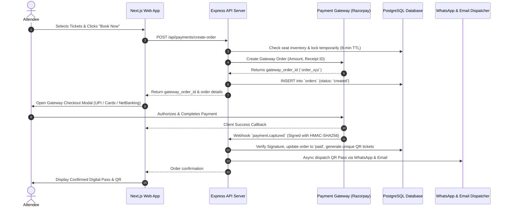

# VibeCheck Ticket Booking & Payments Implementation Plan

**Document Version:** 1.0  
**Target Milestone:** Production Payments & Ticketing Release  
**Scope:** Technical Architecture, Operational Prerequisites, Legal/Compliance, Database Schema, Gateway Integration, and Gate Check-In

---

## 1. Executive Summary & Goals

This document outlines the end-to-end plan to transform VibeCheck from a manual RSVP coordination tool into a fully automated **Event Commerce & Ticketing Platform**.

### Key Deliverables:
1. **Frictionless Attendee Checkout:** In-app ticket purchase supporting UPI (GPay, PhonePe, Paytm), Credit/Debit Cards, and NetBanking via Razorpay/Cashfree.
2. **Cryptographic Digital Passes:** Instant QR ticket generation with tamper-proof signatures delivered via in-app viewer, WhatsApp, and Email.
3. **Inventory & Concurrency Protection:** High-demand ticket reservation locking (8-minute TTL) to prevent overselling.
4. **Organizer Monetization & Escrow:** T+2 post-event settlement payouts with automated platform fee deduction, TDS/TCS compliance, and payout reporting.
5. **On-Ground Gate Operations:** Mobile camera QR scanner for instant attendee check-in and live attendance tracking.

---

## 2. Operational & Legal Prerequisites Matrix

Before processing live payments, the following operational tasks must be completed:

```
┌────────────────────────────────────────────────────────────────────────┐
│                        OPERATIONAL CHECKLIST                           │
├────────────────────────────────────────────────────────────────────────┤
│ [ ] 1. Legal Business Entity (Pvt Ltd / LLP / Registered Enterprise)   │
│ [ ] 2. Active Current Business Bank Account                            │
│ [ ] 3. Business PAN & GST Registration Certificate (GSTIN)             │
│ [ ] 4. Payment Gateway Approval (Razorpay / Cashfree Merchant Account) │
│ [ ] 5. Published Website Policy Pages (T&C, Refund, Privacy, Contact)  │
│ [ ] 6. Support Email & WhatsApp Escalation Channel Active              │
│ [ ] 7. CA/Accounting Alignment for 18% GST on Fees & 1% TDS (194-O)   │
└────────────────────────────────────────────────────────────────────────┘
```

### Mandatory Public Policies on Web App:
1. **Terms & Conditions:** Defines user, organizer, and platform obligations.
2. **Refund & Cancellation Policy:** Explicit terms regarding event cancellations, postponements, and non-refundable tickets.
3. **Shipping / Delivery Policy:** States that all tickets are **digital goods delivered instantaneously** via WhatsApp and Email.
4. **Contact Us Page:** Must display legal business name, registered address, and official support contact (`support@vibecheck.space`).

---

## 3. System Architecture & Money Flow



---

## 4. Database Schema Migrations

Add the following tables to `db/init.sql` (and run database migration):

```sql
-- 1. Ticket Tiers per Event (Multi-Tier & Free/Paid Support)
CREATE TABLE IF NOT EXISTS ticket_tiers (
    id UUID PRIMARY KEY DEFAULT gen_random_uuid(),
    event_id UUID NOT NULL REFERENCES events(id) ON DELETE CASCADE,
    name VARCHAR(100) NOT NULL,                -- e.g. "Early Bird", "General Admission", "VIP"
    description TEXT,
    price NUMERIC(10, 2) NOT NULL DEFAULT 0.00, -- 0.00 for free RSVP
    total_quantity INTEGER NOT NULL,            -- Total seats allocated
    available_quantity INTEGER NOT NULL,        -- Decremented on confirmed purchase
    max_per_user INTEGER DEFAULT 10,            -- Max tickets per transaction
    sales_start_time TIMESTAMP WITH TIME ZONE DEFAULT CURRENT_TIMESTAMP,
    sales_end_time TIMESTAMP WITH TIME ZONE,
    is_active BOOLEAN DEFAULT true,
    created_at TIMESTAMP WITH TIME ZONE DEFAULT CURRENT_TIMESTAMP,
    updated_at TIMESTAMP WITH TIME ZONE DEFAULT CURRENT_TIMESTAMP
);

CREATE INDEX idx_ticket_tiers_event ON ticket_tiers(event_id);

-- 2. Customer Orders
CREATE TYPE order_status AS ENUM (
    'created',      -- Initiated, inventory locked (awaiting payment)
    'processing',   -- Gateway processing
    'paid',         -- Payment captured, tickets issued
    'failed',       -- Payment declined
    'expired',      -- 8-minute lock expired without payment
    'refunded',     -- Fully refunded
    'partially_refunded'
);

CREATE TABLE IF NOT EXISTS orders (
    id UUID PRIMARY KEY DEFAULT gen_random_uuid(),
    user_email VARCHAR(255) NOT NULL,
    user_phone VARCHAR(50),
    event_id UUID NOT NULL REFERENCES events(id) ON DELETE RESTRICT,
    subtotal NUMERIC(10, 2) NOT NULL,          -- Base ticket price sum
    convenience_fee NUMERIC(10, 2) DEFAULT 0.00,-- Platform fee
    tax_amount NUMERIC(10, 2) DEFAULT 0.00,    -- 18% GST on platform fee
    total_amount NUMERIC(10, 2) NOT NULL,      -- Final charged amount
    currency VARCHAR(10) DEFAULT 'INR',
    status order_status DEFAULT 'created',
    gateway_provider VARCHAR(50) DEFAULT 'razorpay',
    gateway_order_id VARCHAR(255) UNIQUE,
    gateway_payment_id VARCHAR(255),
    gateway_signature VARCHAR(255),
    expires_at TIMESTAMP WITH TIME ZONE NOT NULL, -- 8 minutes from creation
    metadata JSONB DEFAULT '{}'::jsonb,
    created_at TIMESTAMP WITH TIME ZONE DEFAULT CURRENT_TIMESTAMP,
    updated_at TIMESTAMP WITH TIME ZONE DEFAULT CURRENT_TIMESTAMP
);

CREATE INDEX idx_orders_user ON orders(user_email);
CREATE INDEX idx_orders_event ON orders(event_id);
CREATE INDEX idx_orders_status ON orders(status);
CREATE INDEX idx_orders_expiry ON orders(expires_at) WHERE status = 'created';

-- 3. Order Line Items
CREATE TABLE IF NOT EXISTS order_items (
    id UUID PRIMARY KEY DEFAULT gen_random_uuid(),
    order_id UUID NOT NULL REFERENCES orders(id) ON DELETE CASCADE,
    tier_id UUID NOT NULL REFERENCES ticket_tiers(id) ON DELETE RESTRICT,
    quantity INTEGER NOT NULL,
    unit_price NUMERIC(10, 2) NOT NULL,
    created_at TIMESTAMP WITH TIME ZONE DEFAULT CURRENT_TIMESTAMP
);

-- 4. Issued Tickets & Security Verification
CREATE TYPE ticket_status AS ENUM ('valid', 'checked_in', 'transferred', 'cancelled');

CREATE TABLE IF NOT EXISTS tickets (
    id UUID PRIMARY KEY DEFAULT gen_random_uuid(),
    order_id UUID NOT NULL REFERENCES orders(id) ON DELETE CASCADE,
    event_id UUID NOT NULL REFERENCES events(id) ON DELETE RESTRICT,
    tier_id UUID NOT NULL REFERENCES ticket_tiers(id) ON DELETE RESTRICT,
    owner_email VARCHAR(255) NOT NULL,
    owner_phone VARCHAR(50),
    attendee_name VARCHAR(255),
    ticket_code VARCHAR(100) UNIQUE NOT NULL,  -- e.g. "VB-8F29A1"
    qr_signature TEXT NOT NULL,                -- HMAC-SHA256 signature
    status ticket_status DEFAULT 'valid',
    checked_in_at TIMESTAMP WITH TIME ZONE,
    checked_in_by VARCHAR(255),                -- Organizer/Staff email
    created_at TIMESTAMP WITH TIME ZONE DEFAULT CURRENT_TIMESTAMP,
    updated_at TIMESTAMP WITH TIME ZONE DEFAULT CURRENT_TIMESTAMP
);

CREATE INDEX idx_tickets_code ON tickets(ticket_code);
CREATE INDEX idx_tickets_event_status ON tickets(event_id, status);

-- 5. Organizer Bank Accounts & KYC
CREATE TABLE IF NOT EXISTS organizer_bank_accounts (
    id UUID PRIMARY KEY DEFAULT gen_random_uuid(),
    organizer_email VARCHAR(255) UNIQUE NOT NULL REFERENCES admins(email) ON DELETE CASCADE,
    account_holder_name VARCHAR(255) NOT NULL,
    account_number VARCHAR(100) NOT NULL,
    ifsc_code VARCHAR(50) NOT NULL,
    bank_name VARCHAR(100),
    pan_number VARCHAR(20),
    gstin VARCHAR(30),
    verification_status VARCHAR(50) DEFAULT 'pending', -- pending | verified | rejected
    created_at TIMESTAMP WITH TIME ZONE DEFAULT CURRENT_TIMESTAMP,
    updated_at TIMESTAMP WITH TIME ZONE DEFAULT CURRENT_TIMESTAMP
);

-- 6. Settlement & Payout Batches
CREATE TYPE payout_status AS ENUM ('scheduled', 'processing', 'completed', 'failed', 'on_hold');

CREATE TABLE IF NOT EXISTS settlements (
    id UUID PRIMARY KEY DEFAULT gen_random_uuid(),
    event_id UUID NOT NULL REFERENCES events(id) ON DELETE RESTRICT,
    organizer_email VARCHAR(255) NOT NULL REFERENCES admins(email),
    gross_sales NUMERIC(12, 2) NOT NULL,
    platform_fee NUMERIC(10, 2) NOT NULL,     -- e.g. 4%
    platform_fee_gst NUMERIC(10, 2) NOT NULL, -- 18% GST on platform fee
    tds_deducted NUMERIC(10, 2) DEFAULT 0.00, -- 1% TDS under Sec 194-O
    tcs_deducted NUMERIC(10, 2) DEFAULT 0.00, -- 1% TCS under GST
    refunds_deducted NUMERIC(10, 2) DEFAULT 0.00,
    net_payout NUMERIC(12, 2) NOT NULL,
    payout_status payout_status DEFAULT 'scheduled',
    scheduled_for TIMESTAMP WITH TIME ZONE NOT NULL, -- Event End Date + 48 Hours
    processed_at TIMESTAMP WITH TIME ZONE,
    gateway_payout_id VARCHAR(255),
    created_at TIMESTAMP WITH TIME ZONE DEFAULT CURRENT_TIMESTAMP
);
```

---

## 5. Backend Implementation Specifications

### A. Environment Configuration (`server/.env`)
```env
RAZORPAY_KEY_ID=rzp_test_...
RAZORPAY_KEY_SECRET=...
RAZORPAY_WEBHOOK_SECRET=...
TICKET_SIGNING_SECRET=...
PLATFORM_FEE_PERCENT=4.0
CONVENIENCE_FEE_FIXED=0.0
```

### B. Core API Endpoints

1. **`POST /api/payments/create-order`**
   * **Body:** `{ event_id, items: [{ tier_id, quantity }], email, phone, attendee_name }`
   * **Logic:** 
     1. Validate ticket availability & seat capacity.
     2. Calculate subtotal, platform convenience fee, and 18% GST.
     3. Call Razorpay API `razorpay.orders.create({ amount, currency: 'INR', receipt })`.
     4. Save order record in DB with `status = 'created'` and `expires_at = NOW() + INTERVAL '8 minutes'`.
     5. Return `gateway_order_id`, `amount`, `currency`, and `key_id`.

2. **`POST /api/payments/verify`** (Client Fast Path)
   * **Body:** `{ razorpay_order_id, razorpay_payment_id, razorpay_signature }`
   * **Logic:** Verifies HMAC-SHA256 signature using `RAZORPAY_KEY_SECRET`. Updates order status to `processing`.

3. **`POST /api/payments/webhook`** (Authoritative Asynchronous Source of Truth)
   * **Headers:** `x-razorpay-signature`
   * **Logic:**
     1. Verify raw request body with `RAZORPAY_WEBHOOK_SECRET`.
     2. On `payment.captured`:
        * Check idempotency (if order is already `'paid'`, return 200).
        * Set `orders.status = 'paid'`.
        * Generate unique cryptographic tickets and QR passes.
        * Decrement available quantity on `ticket_tiers`.
        * Trigger async background dispatch (WhatsApp template message + Email confirmation).
     3. On `payment.failed`:
        * Mark order as `'failed'` and release inventory hold.

4. **`GET /api/user/tickets`**
   * Returns all confirmed passes belonging to the authenticated user.

5. **`POST /api/organizer/scanner/verify`**
   * **Body:** `{ qr_data, event_id }`
   * **Logic:** Validates HMAC signature inside QR token. If valid and `status = 'valid'`, marks ticket as `'checked_in'` with timestamp and scanner identity. If already scanned, returns 409 with prior scan time.

---

## 6. Frontend & User Experience Roadmap

### 1. Checkout Drawer (`web/src/app/event/[id]/TicketCheckoutModal.tsx`)
* Seamless slide-over / bottom drawer on mobile.
* Tier selection counter (e.g. `[ - ] 2 [ + ] VIP Pass @ ₹499`).
* Fee breakdown:
  * Subtotal: ₹998.00
  * Platform & Processing Fee: ₹39.92
  * GST (18% on Fee): ₹7.18
  * **Total Payable: ₹1,045.10**
* Direct launch of Razorpay Checkout modal.

### 2. Digital Pass Viewer (`web/src/app/tickets/page.tsx` & Briefing Modal)
* Rich pass design with dynamic QR code (using `qrcode.react`).
* Action buttons:
  * 📱 Add to Google / Apple Wallet
  * 📅 Add to Google Calendar (`.ics`)
  * 📍 Open Venue in Google Maps
  * 💬 Join Official Attendee WhatsApp Group

### 3. Organizer Gate Scanner (`web/src/app/organizer/scanner/page.tsx`)
* Mobile browser camera scanner powered by `html5-qrcode`.
* Visual & Audio cues:
  * 🟢 **Green Screen + Chime:** Valid Pass $\rightarrow$ Attendee Name + Pass Tier.
  * 🔴 **Red Screen + Buzzer:** Already Scanned $\rightarrow$ Shows previous check-in time.
  * ⚠️ **Yellow Screen:** Invalid / Wrong Event.

---

## 7. Phased Execution Plan

```
Phase 1: Payment Foundation & Gateway Setup (Sprint 1)
├── Install Razorpay SDK & configure environment variables
├── Run database migrations (orders, tickets, ticket_tiers)
├── Build /api/payments/create-order and /api/payments/webhook
└── Build frontend Razorpay modal checkout on Event details page

Phase 2: Pass Generation & Digital Wallet (Sprint 2)
├── Implement HMAC-signed QR ticket generator
├── Build /tickets page and Pass Viewer modal
└── Connect automatic WhatsApp & Email pass dispatch

Phase 3: Gate Scanner & Organizer Operations (Sprint 3)
├── Build mobile camera QR scanner in Organizer Dashboard
├── Real-time gate check-in analytics and counter
└── Attendee CSV export with ticket & payment IDs

Phase 4: Multi-Tier Pricing & Settlement Engine (Sprint 4)
├── Add multi-tier ticket creator to Event Create/Edit form
├── Build T+2 automated settlement calculation cron
└── Add Organizer Bank Details & Payout Management UI
```

---

## 8. Verification & Test Plan

1. **Gateway Sandbox Testing:**
   * Test successful payments via Razorpay Test UPI / Test Card numbers.
   * Simulate payment failures, modal dismissals, and network drops.
2. **Webhook Idempotency & Signature Verification:**
   * Test simulated webhook payloads using Razorpay CLI / Postman.
   * Verify duplicate webhook deliveries do not create duplicate tickets.
3. **Concurrency & Inventory Testing:**
   * Simulate simultaneous checkouts when 1 ticket remains to verify zero overbooking.
4. **Scanner & Check-in Testing:**
   * Verify genuine pass scan vs duplicate scan vs invalid event pass scan.
